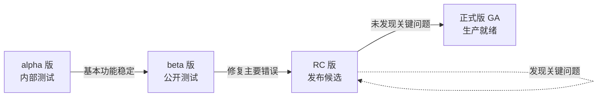

好的，这是一个非常核心的软件发布管理概念。`alpha`、`beta` 和 `rc` 是软件**预发布阶段**的标签，它们标志着软件的成熟度、稳定性和目标受众。

你可以通过下面的流程图和表格来直观地理解它们的区别与演进过程：



| 特性           | alpha                              | beta                                    | Release Candidate (RC)             |
| :------------- | :--------------------------------- | :-------------------------------------- | :--------------------------------- |
| **中文名**     | **内测版**                         | **公测版**                              | **发布候选版**                     |
| **阶段**       | 早期                               | 中期                                    | 晚期，**正式版之前**               |
| **稳定性**     | **低**，可能充满错误和崩溃         | **中等**，主要功能可用，但存在已知问题  | **高**，**功能完整且已深度测试**   |
| **目标用户**   | **内部开发与测试团队**             | **外部“尝鲜”用户**、友好客户            | **全体用户**，用于最终验证         |
| **主要目的**   | 验证**核心功能**、发现**严重缺陷** | 在**不同硬件/环境**下发现更多兼容性问题 | **确认没有回归性错误或阻碍性缺陷** |
| **发布频率**   | 高频率，可能每日构建               | 中等频率，按周或按月                    | 低频率，直到确认稳定为止           |
| **功能完整性** | **不完整**，正在开发中             | **基本完整**，但可能缺少某些边缘功能    | **完全锁定**，**不应再添加新功能** |

---

### 🛠️ 在 Changesets 中的实践

在 Changesets 中，你可以非常方便地管理这些预发布版本。

#### 1. 进入预发布模式

首先，你需要让 Changesets 知道项目进入了预发布模式。这会在发布时自动打上相应的标签。

```bash
# 进入预发布模式，并指定为 beta
pnpm changeset pre enter beta
# 同样，你也可以使用 'alpha' 或 'rc'
# pnpm changeset pre enter alpha
# pnpm changeset pre enter rc
```

执行此命令后，Changesets 会记住当前处于预发布状态。之后所有通过 `pnpm changeset version` 生成的版本号都会自动带上预发布标签。

**例如：**
*   当前版本是 `1.2.3`
*   你有一个 `minor` 变更。
*   在 `beta` 预发布模式下，`pnpm changeset version` 会将版本号更新为 `1.3.0-beta.0`。
*   如果你再次提交一个变更（比如一个 `patch`）并运行 `version`，版本会变为 `1.3.0-beta.1`，依此类推。

#### 2. 发布预发布版本

在预发布模式下，你可以像往常一样使用 `pnpm changeset version` 和 `pnpm publish`。发布到 npm 的包将带有预发布标签。

**重要：** 当你使用 `pnpm publish` 时，默认情况下，npm 会将其标记为 `latest`。但为了不让预发布版本被所有用户安装，**你应该显式地指定标签**：

```bash
# 发布一个 beta 版本，并打上 'beta' 标签
pnpm publish --tag beta
```

这样，用户必须明确指定标签才能安装你的预发布版本：`pnpm install your-package@beta`。

#### 3. 退出预发布模式

当你的 RC 版本经过充分测试，确认可以作为正式版发布时，就需要退出预发布模式。

```bash
pnpm changeset pre exit
```

然后，再次运行 `pnpm changeset version`。这次，它会将所有待处理的变更**一次性**整合，并生成一个干净的正式版本号。

**例如：**
*   当前版本是 `2.0.0-rc.2`（在 `rc` 预发布模式下）。
*   你运行 `pnpm changeset pre exit`。
*   然后运行 `pnpm changeset version`。
*   如果自 `rc.2` 以来只有一些 `patch` 变更，最终版本号将是 `2.0.0`。如果有一些 `minor` 变更，则可能是 `2.1.0`。

### 总结与最佳实践

1.  **循序渐进**：严格遵循 `alpha` -> `beta` -> `rc` -> `正式版` 的流程，确保软件质量逐步稳定。
2.  **明确受众**：不要向错误的用户群体分发错误的版本（例如，将 alpha 版发给普通用户）。
3.  **在 Changesets 中善用标签**：发布预发布版本时**务必使用 `--tag` 参数**，避免污染 `latest` 通道。
4.  **RC 版是准正式版**：对待 RC 版本要像对待正式版一样严肃，在此阶段通常只修复 Bug，不添加新功能。

通过这种方式，Changesets 帮助你实现了从功能开发、预发布测试到最终正式上线的全流程自动化版本管理。


========================================================================================================

**完全不需要手动指定 minor 或手动更改版本号！** Changesets 的核心价值就是**自动判断和提升版本号**。

当你运行 `pnpm changeset` 时，交互式命令行会帮你完成所有判断：

## 🛠️ 正确的操作流程

### 1. 创建变更集时选择版本类型

```bash
$ pnpm changeset
# 接下来是交互式流程：

# 1. 首先选择受影响的包（如果是monorepo）
? Which packages would you like to include? ›
⬢ package-a
⬡ package-b

# 2. 然后选择 MAJOR 变更的包（按空格选择，回车确认）
? Which packages should have a major bump? › 
⬡ package-a
⬡ package-b
# ✅ 直接按回车跳过（因为你的变更不是major）

# 3. 然后选择 MINOR 变更的包
? Which packages should have a minor bump? › 
⬢ package-a  # ← 在这里选择你的包
⬡ package-b
# ✅ 按空格选中包含 minor 变更的包，然后回车

# 4. 最后撰写变更描述
? Please enter a summary for this change (this will be in the changelogs).
# 在这里描述你的新功能，比如：
# Add new dashboard feature with user analytics
```

### 2. Changesets 自动处理版本号

当你合并 PR 后，在主分支运行：

```bash
pnpm changeset version
```

Changesets 会：
- 读取你之前创建的变更集文件
- **自动识别**出你标记为 `minor` 的变更
- 将版本号从 `1.2.3` → `1.3.0`（遵循语义化版本规则）
- 自动更新 `CHANGELOG.md`，将你的变更描述收录进去

## ❌ 不要这样做

```bash
# 不需要手动修改 package.json！
# ❌ 不要这样：手动改版本号 "version": "1.3.0"
# ❌ 不要这样：手动编辑 CHANGELOG.md

# 也不需要强制指定版本类型！
# ❌ 不需要：pnpm changeset minor（这个命令不存在）
```

## 💡 版本号自动提升规则

Changesets 根据变更集的类型自动计算最终版本号：

| 包含的变更类型                     | 最终版本提升      | 示例       |
| ---------------------------------- | ----------------- | ---------- |
| 只有 `patch` 变更                  | `1.2.3` → `1.2.4` | 只修复bug  |
| 有 `minor` 变更（无论是否有patch） | `1.2.3` → `1.3.0` | 添加新功能 |
| 有 `major` 变更（无论是否有其他）  | `1.2.3` → `2.0.0` | 破坏性变更 |

**总结：你只需要在 `pnpm changeset` 交互过程中正确选择版本类型，Changesets 会处理剩下的一切！**

这样既保证了版本号的准确性，又保持了 changelog 的自动化和一致性。

```
发布流程
新建一个release分支, 作为本迭代要发版的分支
新建 feature分支, 合一下release分支, 当我们开发完并初步自测完成后, 进入codeReview环节, 通过后合到release分支,进入release分支
执行 pnpm changeset add,
根据提示选择要发布的包, 这里最好一次只选择一个, 相互影响的包changeset会自动处理
根据提示选择需要发布的版本号 major(主要版本), minor(次要版本), patch(小版本)
根据提示输入本次总结性话语, 确定后如果要补充信息, 进入.changeset中找到对应的 md 文件进行补充
执行 pnpm changeset pre enter <tag>, 命令进入进入 pre 模式
pnpm changeset pre enter alpha   # 发布 alpha 版本
pnpm changeset pre enter beta    # 发布 beta 版本
pnpm changeset pre enter rc      # 发布 rc 版本
执行 pnpm changeset version 更改版本号
执行 pnpm run build --filter 你要发布的包, 打包, 如果多个项目, 请多次执行
执行 pnpm changeset publish 发布 测试版本
项目内测试完成后, 发布正式版本, 执行 pnpm changeset pre exit 退出 pre 模式
执行 pnpm changeset version 更改版本为正式版本号
更新 docs项目, 版本信息, 以及 文档信息
执行 pnpm run build --filter 你要发布的包 打包
执行 pnpm changeset publish 发布正式版本, 迭代结束
```

