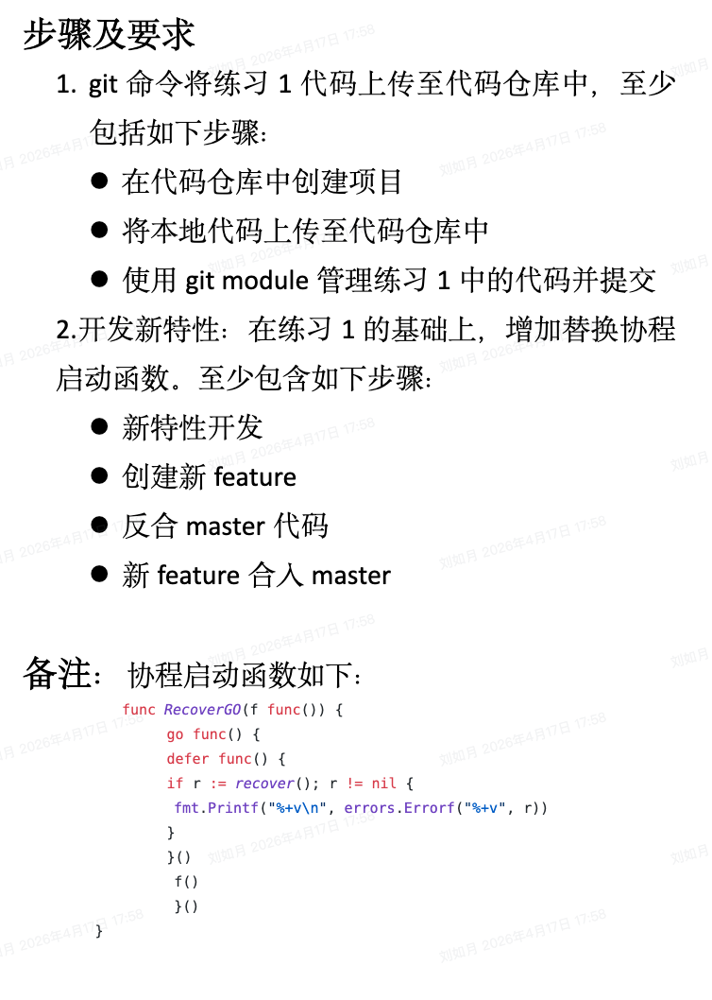

# **说明：**

1. 学习路径的参考资料有视频教程和文字教程，学习时可以以视频教程为主，文字教程为辅；大家也可以不仅限于这些资料，遇到问题也可以自行查找其他相关资料
    
2. 七猫共享网盘地址： [http://qmnas.km.com:5000/](http://qmnas.km.com:5000/) （账户：姓名全拼、密码：手机号）
    
3. 表格内学习路径资料无特殊说明均为必看内容
    
4. 建议视频教程可根据实际情况调节单个视频播放速度，以节约时间
    

  

|     |                                                                                           |                                                                                                                                                                                                                                                                                                                                                                                                                                                                                                                                                                                                                                                                                                                                                                                                                               |          |                                                                                        |     |
| --- | ----------------------------------------------------------------------------------------- | ----------------------------------------------------------------------------------------------------------------------------------------------------------------------------------------------------------------------------------------------------------------------------------------------------------------------------------------------------------------------------------------------------------------------------------------------------------------------------------------------------------------------------------------------------------------------------------------------------------------------------------------------------------------------------------------------------------------------------------------------------------------------------------------------------------------------------- | -------- | -------------------------------------------------------------------------------------- | --- |
|     | 学习培训                                                                                      | 学习路径                                                                                                                                                                                                                                                                                                                                                                                                                                                                                                                                                                                                                                                                                                                                                                                                                          | 建议最多学习时长 | 考核                                                                                     | 备注  |
|     | golang语法                                                                                  | golang极客时间教程： [七猫共享网盘地址](http://qmnas.km.com:5000/index.cgi?launchApp=SYNO.SDS.App.FileStation3.Instance&launchParam=openfile%3D%252F%25E7%25A0%2594%25E5%258F%2591%25E4%25B8%25AD%25E5%25BF%2583_%25E5%25AD%25A6%25E4%25B9%25A0%25E5%2585%25B1%25E4%25BA%25AB%25E5%258C%25BA%252F%25E6%259C%258D%25E5%258A%25A1%25E7%25AB%25AF%252FGo%25E8%25AF%25AD%25E8%25A8%2580%25E4%25BB%258E%25E5%2585%25A5%25E9%2597%25A8%25E5%2588%25B0%25E5%25AE%259E%25E6%2588%2598%252F)                                                                                                                                                                                                                                                                                                                                                          | 8天       | 熟悉golang的语言特性，基本语法，并完成对应的练习题                                                           |     |
|     | 熟悉golang官方基础包及cobra包使用                                                                    | golang官方包：fmt、io、strconv、os、file，strings （熟悉基础包的使用）  cobra github地址： [https://github.com/spf13/cobra](https://github.com/spf13/cobra)  cobra官方简易教程： [https://github.com/spf13/cobra#getting-started](https://github.com/spf13/cobra#getting-started) ( 建议优先阅读官方教程，后续可自行参考其他网上教程 )                                                                                                                                                                                                                                                                                                                                                                                                                                                                                                                                 | 1天       | 熟悉cobra **包** API **的** 使用，并完成对应的练习题                                                   |     |
|     | ### **练习** ：  暂时无法在飞书文档外展示此内容  ### (题目要求见文件，开始做练习时再进行细致讲解)  ### 最迟提交时间： |                                                                                                                                                                                                                                                                                                                                                                                                                                                                                                                                                                                                                                                                                                                                                                                     | 1天       |                                                                                        |     |
|     | golang包管理，包括go module的原理及使用                                                               | 基础教程： [https://cloud.tencent.com/developer/article/1593734](https://cloud.tencent.com/developer/article/1593734)  原理文章1: [https://segmentfault.com/a/1190000020522261](https://segmentfault.com/a/1190000020522261)  原理文章2: [https://tonybai.com/2019/12/21/go-modules-minimal-version-selection/](https://tonybai.com/2019/12/21/go-modules-minimal-version-selection/) （选看）                                                                                                                                                                                                                                                                                                                                                                                                                                     | 1天       | 了解go module的设计原则以解决的问题  熟悉go module相关命令的使用  了解go module常见的坑以及解决go包问题的思路及手段 |     |
|     | 了解git原理及命令  理解gitflow工作流  熟悉sourceTree的使用                                     | git极客时间： [七猫共享网盘地址](http://qmnas.km.com:5000/index.cgi?launchApp=SYNO.SDS.App.FileStation3.Instance&launchParam=openfile%3D%252F%25E7%25A0%2594%25E5%258F%2591%25E4%25B8%25AD%25E5%25BF%2583_%25E5%25AD%25A6%25E4%25B9%25A0%25E5%2585%25B1%25E4%25BA%25AB%25E5%258C%25BA%252F%25E6%259C%258D%25E5%258A%25A1%25E7%25AB%25AF%252F%25E7%258E%25A9%25E8%25BD%25ACGit%25E4%25B8%2589%25E5%2589%2591%25E5%25AE%25A2%252F) （ 视频1-40为必看部分，其余可选择性观看 ）  gitflow流程： [http://www.ruanyifeng.com/blog/2015/12/git-workflow.html](http://www.ruanyifeng.com/blog/2015/12/git-workflow.html)  source tree下载地址： [https://www.sourcetreeapp.com/](https://www.sourcetreeapp.com/)  sourceTree基础使用教程： [https://b23.tv/bXATrt](https://b23.tv/bXATrt)  gitflow b站视频： [https://b23.tv/migP2b](https://b23.tv/migP2b) (选看) | 4天       | 熟悉git原理及常用命令，理解gitflow工作流  能够使用sourceTree上传更新代码，解决冲突，新建项目等操作，并完成练习               |     |
|     | 了解linux常用命令的使用                                                                            | [https://blog.csdn.net/qq_41868500/article/details/86434659](https://blog.csdn.net/qq_41868500/article/details/86434659)  [https://blog.csdn.net/wade3015/article/details/85073961](https://blog.csdn.net/wade3015/article/details/85073961)  [https://www.bilibili.com/read/cv6148869/](https://www.bilibili.com/read/cv6148869/) （选看）                                                                                                                                                                                                                                                                                                                                                                                                                                                                           | 2天       | 熟悉常用linux基本命令                                                                          |     |
|     | ### **练习** ：  暂时无法在飞书文档外展示此内容  ### (题目要求见文件，开始做练习时再进行细致讲解)  ### 最迟提交时间： |                                                                                                                                                                                                                                                                                                                                                                                                                                                                                                                                                                                                                                                                                                                                                                                     | 1.5天     |                                                                                        |     |
|     | 了解mysql原理及常规命令                                                                            | b站基础教程： [https://b23.tv/QmyOPG](https://b23.tv/QmyOPG)  mysql极客时间： [七猫共享网盘地址](http://qmnas.km.com:5000/index.cgi?launchApp=SYNO.SDS.App.FileStation3.Instance&launchParam=openfile%3D%252F%25E7%25A0%2594%25E5%258F%2591%25E4%25B8%25AD%25E5%25BF%2583_%25E5%25AD%25A6%25E4%25B9%25A0%25E5%2585%25B1%25E4%25BA%25AB%25E5%258C%25BA%252F%25E6%259C%258D%25E5%258A%25A1%25E7%25AB%25AF%252FMySQL%25E5%25AE%259E%25E6%2588%259845%25E8%25AE%25B2%252F) （ 建议该课程长期反复看 ）                                                                                                                                                                                                                                                                                                                                                      | 8天       | 了解mysql的使用场景  了解mysql原理，基本命令的使用如增删改查，join, groupby等  了解ACID特性、事务、索引原理等     |     |
|     | ### **练习** ：  暂时无法在飞书文档外展示此内容  ### (题目要求见文件，开始做练习时再进行细致讲解)  ### 最迟提交时间： |                                                                                                                                                                                                                                                                                                                                                                                                                                                                                                                                                                                                                                                                                                                                                                                                                               | 1天       |                                                                                        |     |
|     | 了解http协议以及DNS相关                                                                           | http基础教程： [https://www.runoob.com/http/http-tutorial.html](https://www.runoob.com/http/http-tutorial.html)  http极客时间： [七猫共享网盘地址](http://qmnas.km.com:5000/index.cgi?launchApp=SYNO.SDS.App.FileStation3.Instance&launchParam=openfile%3D%252F%25E7%25A0%2594%25E5%258F%2591%25E4%25B8%25AD%25E5%25BF%2583_%25E5%25AD%25A6%25E4%25B9%25A0%25E5%2585%25B1%25E4%25BA%25AB%25E5%258C%25BA%252F%25E6%259C%258D%25E5%258A%25A1%25E7%25AB%25AF%252Fweb%25E5%258D%258F%25E8%25AE%25AE%25E8%25AF%25A6%25E8%25A7%25A3%25E4%25B8%258E%25E6%258A%2593%25E5%258C%2585%25E5%25AE%259E%25E6%2588%2598%252F) ( 视频1-36，69-109为必看部分，其余可选择性观看， 建议该课程长期反复看 )                                                                                                                                                                                | 5天       | 了解http协议原理及使用场景。  了解http的请求方式，状态码以及抓包相关                                          |     |
|     | golang http包的使用                                                                           | b站基础教程： [https://b23.tv/P2bGI9](https://b23.tv/P2bGI9)                                                                                                                                                                                                                                                                                                                                                                                                                                                                                                                                                                                                                                                                                                                                                                        | 1天       | 熟悉http包的基础使用，能够用golang的http包进行简单网络请求                                                   |     |
|     | 熟悉gin框架以及使用                                                                               | github地址： [github.com/gin-gonic/gin](http://wiki.km.com/github.com/gin-gonic/gin)  中文文档地址： [https://gin-gonic.com/zh-cn/docs/](https://gin-gonic.com/zh-cn/docs/)  暂时无法在飞书文档外展示此内容                                                                                                                                                                                                                                                                                                                                                                                                                                                                                                                                                                                                                                | 3天       | 了解gin的基本用法，以及一些特性如middleward,参数绑定等                                                     |     |
|     | 熟悉postman,charles，switchhosts的使用                                                          | postman下载地址： [https://www.postman.com/downloads/](https://www.postman.com/downloads/)  postman教程： [https://www.jianshu.com/p/97ba64888894](https://www.jianshu.com/p/97ba64888894)  charles下载地址： [https://www.charlesproxy.com/](https://www.charlesproxy.com/)  charles教程： [https://blog.csdn.net/forebe/article/details/98945139](https://blog.csdn.net/forebe/article/details/98945139)  switchhosts基础使用教程： [https://www.cnblogs.com/xfcao/p/13062241.html](https://www.cnblogs.com/xfcao/p/13062241.html) （选看）                                                                                                                                                                                                                                                                                    | 1天       | 熟悉postman的使用，能够用于调试  熟悉charles的使用，配置，给服务器做压力测试                                   |     |
|     | ### **练习** ：  暂时无法在飞书文档外展示此内容  ### (题目要求见文件，开始做练习时再进行细致讲解)  ### 最迟提交时间： |                                                                                                                                                                                                                                                                                                                                                                                                                                                                                                                                                                                                                                                                                                                                                                                  | 4天       |                                                                                        |     |
|     | 了解nginx以及基础应用                                                                             | b站基础教程： [https://b23.tv/IwuVab](https://b23.tv/IwuVab)                                                                                                                                                                                                                                                                                                                                                                                                                                                                                                                                                                                                                                                                                                                                                                        | 1天       | 能够进行nginx的环境搭建，简单应用，并完成练习                                                              |     |
|     | 了解CDN相关知识                                                                                 | [https://zhuanlan.zhihu.com/p/28940451](https://zhuanlan.zhihu.com/p/28940451)                                                                                                                                                                                                                                                                                                                                                                                                                                                                                                                                                                                                                                                                                                                                                | 0.5天     | 了解cdn的工作原理，作用以及使用场景                                                                    |     |
|     | ### **练习** ：  暂时无法在飞书文档外展示此内容  ### (题目要求见文件，开始做练习时再进行细致讲解)  ### 最迟提交时间： |                                                                                                                                                                                                                                                                                                                                                                                                                                                                                                                                                                                                                                                                                                                                                                                                                               | 1.5天     |                                                                                        |     |
|     | 了解redis原理、常用类型以及常规命令的使用                                                                   | 基础教程： [https://www.runoob.com/redis/redis-tutorial.html](https://www.runoob.com/redis/redis-tutorial.html)  实战相关可参考： [Redis深度历险](http://wiki.km.com/pages/viewpage.action?pageId=2431234)                                                                                                                                                                                                                                                                                                                                                                                                                                                                                                                                                                                                                               | 5天       | 了解redis原理以及使用场景  了解常用类型的实现及常规命令的使用                                               |     |
|     | ### **练习** ：  暂时无法在飞书文档外展示此内容  ### (题目要求见文件，开始做练习时再进行细致讲解)  ### 最迟提交时间： |                                                                                                                                                                                                                                                                                                                                                                                                                                                                                                                                                                                                                                                                                                                                                                                                                               | 2天       |                                                                                        |     |
|     | 了解rabbitmq原理以及几种工作模式                                                                      | b站基础教程： [https://b23.tv/Fsq5eC](https://b23.tv/Fsq5eC)                                                                                                                                                                                                                                                                                                                                                                                                                                                                                                                                                                                                                                                                                                                                                                        | 5天       | 了解rabbitmq原理以及使用场景  了解rabbitmq的几种工作模式                                            |     |
|     | ### **练习** ：  暂时无法在飞书文档外展示此内容  ### (题目要求见文件，开始做练习时再进行细致讲解)  ### 最迟提交时间： |                                                                                                                                                                                                                                                                                                                                                                                                                                                                                                                                                                                                                                                                                                                                                                                                                               | 2天       |                                                                                        |     |
|     | 了解mongodb原理及常规命令                                                                          | 基础教程： a. [https://www.runoob.com/mongodb/mongodb-tutorial.html](https://www.runoob.com/mongodb/mongodb-tutorial.html) b. [http://www.zzvips.com/article/63765.html](http://www.zzvips.com/article/63765.html) （选看）  高级查询教程： [https://www.cnblogs.com/zhoujie/p/mongo1.html](https://www.cnblogs.com/zhoujie/p/mongo1.html)                                                                                                                                                                                                                                                                                                                                                                                                                                                                                              | 3天       | 了解mongodb原理以及使用场景，优势劣势  熟悉mongodb常规命令的使用                                         |     |
|     | ### **练习** ：  暂时无法在飞书文档外展示此内容  ### (题目要求见文件，开始做练习时再进行细致讲解)  ### 最迟提交时间： |                                                                                                                                                                                                                                                                                                                                                                                                                                                                                                                                                                                                                                                                                                                                                                                                                               | 3天       |                                                                                        |     |