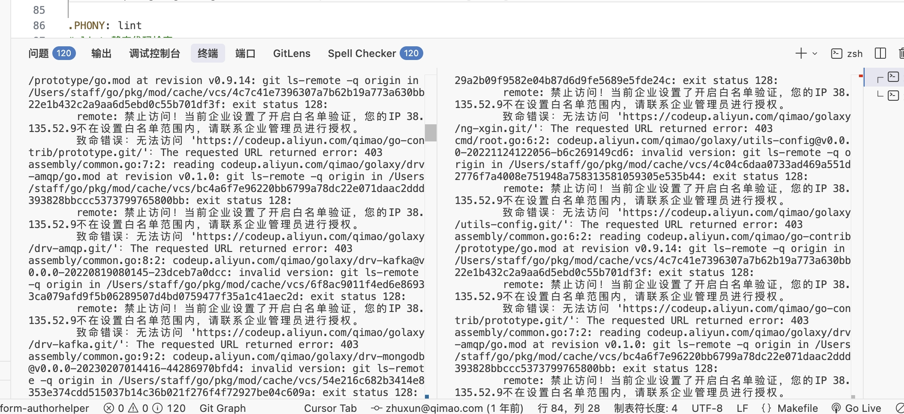
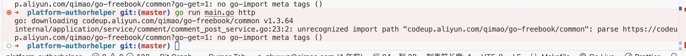

# 本项目服务端运行指南

> [!info] 本文已归档
> 原有内容已拆分为结构化笔记，请根据需求跳转对应章节。原文档保留此处作为入口索引。

---

## 📂 内容索引

### Go 服务端配置

详细步骤见：[[01_环境搭建]]

涵盖内容：
- Go SDK 安装与验证
- VS Code + Go 插件配置
- **私有模块访问**（GOPRIVATE / .netrc / 阿里云 codeup）
- **Protoc 编译工具**安装
- **hosts 配置**
- **服务启动** `go run main.go http`

### 前端本地开发配置

详细步骤见：[[本项目前端本地开发指南]]

涵盖内容：
- Vite 代理配置（`/api/api/copyright` → 本地 Go 服务）
- `.env.development` 环境变量
- Axios 调试模式切换

---

## 🚀 快速启动（精简版）

```bash
# 1. 配置私有模块（首次配置）
go env -w GOPRIVATE=codeup.aliyun.com
go env -w GONOPROXY=codeup.aliyun.com
go env -w GONOSUMDB=codeup.aliyun.com

# 2. 启动 Go 服务
go run main.go http

# 3. 启动前端（见 [[本项目前端本地开发指南]]）
```

---


## 常见问题
1. 开了全局代理


2. 有权限，提示未找到仓库路径，原因是没有配置凭据~/.netrc


3. 无权限
   
## 📝 更新记录

- 2026-04-16：内容拆分至 [[01_环境搭建]] 和 [[本项目前端本地开发指南]]，本文降级为入口索引
