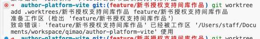

当前项目需要切换到**master**分支，在终端中打开当前项目，执行`mkdir -p .worktrees`

若同一个项目有两个需求分支需要同时进行，在2个终端分别打开这个项目

终端1执行：

`git worktree add .worktrees/对公签约结算 feature/对公益约结算线上化`

终端2执行：

`git worktree add .worktrees/收入扶持 feature/原创品类作品收入扶持5.0 `

查看当前的worktree:  `git worktree list`

开发完成后，删除worktrees，在当前项目下执行：

`git worktree remove .worktrees/收入扶持`

### 常见报错

当前项目也在这个功能分支，需要先切换到master分支
