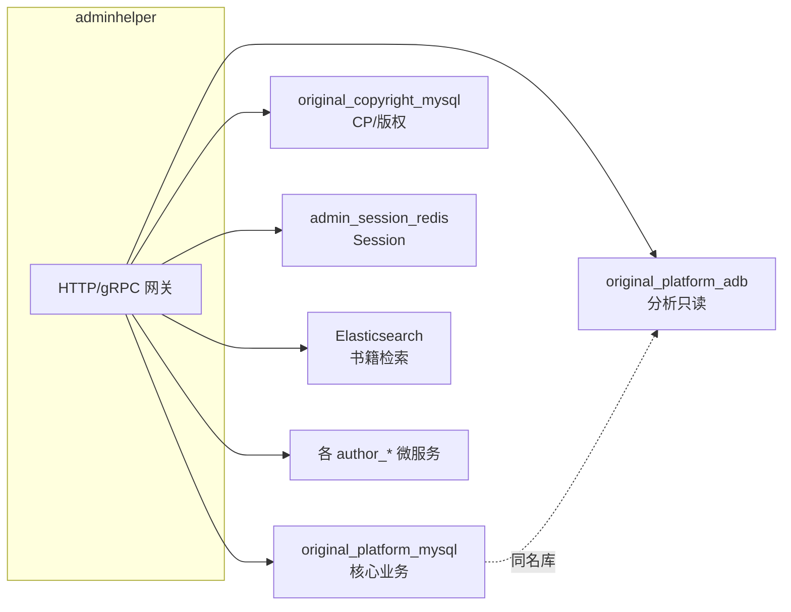
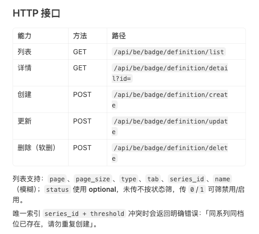
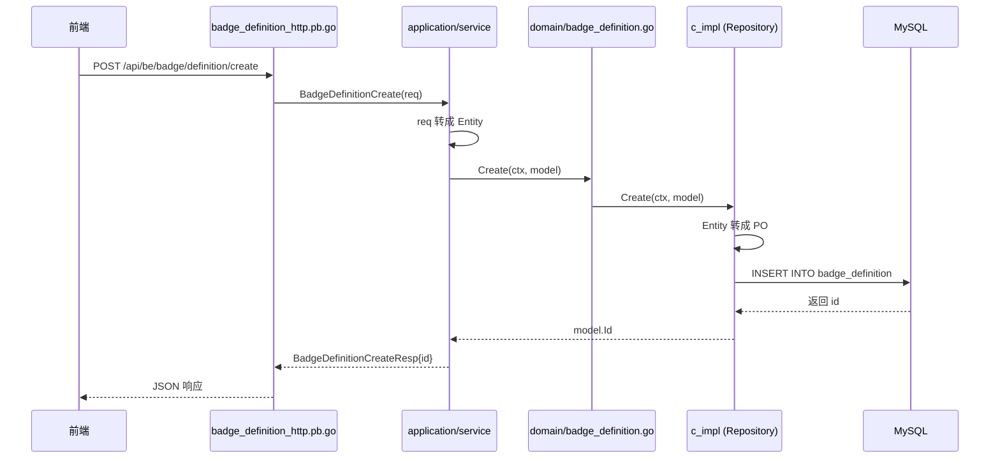
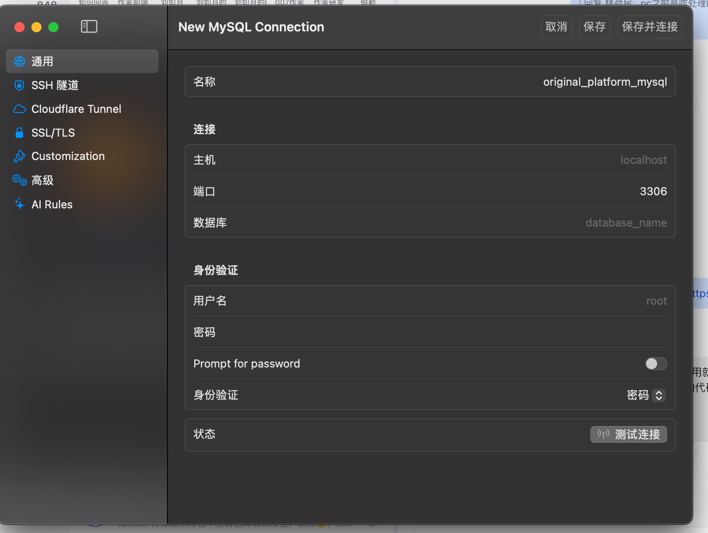
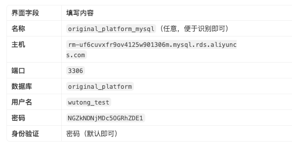

根据 `configs/debug/config.yaml`、`internal/conf/conf.proto` 以及各 `internal/infra/data/*` 包的用法，**adminhelper** 里和「库」相关的存储大致如下。

## 关系型 / 分析库（MySQL 协议）

| 配置项 | 库名（测试环境） | 代码包 | 主要用途 |
|--------|------------------|--------|----------|
| `original_platform_mysql` | `original_platform` | `mysql_platform` | **核心业务库**：后台账号/权限、组织架构、作者账号与作品、审核提醒、活动、资源库、导出配置、列权限等 |
| `original_copyright_mysql` | `platform_copyright` | `mysql_wutong`（目录名易误导） | **版权/CP 库**：`reader_cp`、`reader_cp_book` 等，书籍服务里查 CP、授权、对接信息 |
| `original_platform_adb` | `original_platform`（ADB 只读） | `adb` | **分析型只读副本**：测书统计、签约信息、分类、免费书关系等重查询/报表类数据 |
| `original_wutong_mysql` | `original_wutong` | — | **已配置客户端，当前无 Repository 接入**（wire 里也未注入业务层） |
| `bigdata_star_rocks` | `edw_dwt` | `starrocks` | **数仓 StarRocks**：`dwt_book_qm_book_topic_acc_d` 等测书主题汇总；**有实现但未加入 admin/openapi/consumer 的 wire**，运行时基本未用 |

### 1. `original_platform_mysql`（主库）

承载作家后台网关的大部分本地状态，例如：

- **权限与后台用户**：`admin_account`、`access_*`、`admin_col_access` 等  
- **组织**：`auth_org*`、`auth_organization*`  
- **作者/作品**：`author_account`、`author_book`、`author_bind_uid`、`book_free_relation`  
- **运营配置**：`book_activity_*`、`resource_library`、`app_forbid_config`、`authorsay_publish_guide`  
- **审核/导出**：`admin_review_remind`、`author_book_async_export`、`admin_operate_log` 等  

对应 `internal/infra/data/mysql_platform/provider_set.go` 里注册的各类 Repo。

### 2. `original_copyright_mysql`（版权库）

虽然代码目录叫 `mysql_wutong`，实际注入的是 `OriginalCopyrightMysqlClient`，连的是 **`platform_copyright`**：

- `reader_cp`：CP 方信息  
- `reader_cp_book`：作品与 CP 的授权/对接关系  

用于 `BookService` 等场景中的 CP、版权来源相关查询。

### 3. `original_platform_adb`（ADB 只读）

与主库同名库 `original_platform`，走 **AnalyticDB 只读实例**，避免大查询打主库。典型表/能力包括：

- `book_statistics_latest_data`：测书看板、完结测书统计（`TestingStatisticsService`）  
- `author_sign_info` / `author_sign_contract_info`：签约统计  
- `book_category`、`author_book`、`book_free_relation` 的 ADB 侧查询  

仅在 **admin 主服务** 的 wire 中注入（`cmd/admin/wire_gen.go`）。

### 4. `original_wutong_mysql` / `bigdata_star_rocks`（配置存在，业务几乎未接）

- **`original_wutong`**：配置和 `NewOriginalWutongMysqlClient` 都有，但全仓库没有 Repo 使用。  
- **StarRocks `edw_dwt`**：`DwtBookQmBookTopicAccDRepo` 已实现测书汇总查询，但未出现在各 cmd 的 wire 中，属于预留/未完成接入。

---

## Redis

| 配置项 | 用途 |
|--------|------|
| `admin_session_redis` | **后台登录态**：读 `PHPREDIS_SESSION:{sessionId}`，与 PHP 后台 session 兼容（`internal/infra/middleware/seesion.go`） |

---

## Elasticsearch

| 配置项 | 用途 |
|--------|------|
| `elasticsearch.data_center` | **书籍检索索引**（`BookIndex`）：列表、筛选、内容审核里按条件搜书，带数据权限过滤 |

用于 `book`、`content/review` 等需要复杂条件检索的场景，不是事务型主数据存储。

---

## 相关但不算「业务库」的存储

| 类型 | 配置 | 用途 |
|------|------|------|
| **Kafka** | `system_log_kafka` | 系统/路由访问日志上报（`RouteMiddleware`），topic `original_system_log` |
| **RabbitMQ** | 多个 queue | 消息推送、编辑配置同步、异步导出、资源库更新等，不是持久化业务库 |
| **gRPC 下游** | `author_*_grpc` 等 | 作者中心、内容、签约等由其他服务持库，adminhelper 只做网关聚合 |

---

## 架构关系（简图）



---

## 小结

**日常真正在跑的「数据库」主要是 4 个：**

1. **MySQL `original_platform`** — 后台与原创业务主数据  
2. **MySQL `platform_copyright`** — CP/读者版权对接  
3. **ADB `original_platform`（只读）** — 统计/测书/签约等大查询  
4. **Redis** — Session  
5. **Elasticsearch** — 书籍搜索索引  

**`original_wutong` 与 StarRocks** 在配置和客户端层已准备好，但当前 wire/业务层基本未使用；若你在配置里看到它们，多半是历史或待接入的数仓能力。

如需按「某个接口用了哪个库」逐条对照，可以说一下模块名（例如测书统计、书籍列表），我可以再细化到 Service/Repo 级别。


### 🚀 总结：一次请求的完整旅程

假设前端请求 `GET /api/v1/badge/list?page=1&size=10`：

| 步骤  | 层级         | 动作                             | 类比        |
| --- | ---------- | ------------------------------ | --------- |
| 1   | **HTTP注册** | 接收到 `/badge/list` 请求，找到对应处理函数  | 顾客按照菜单点餐  |
| 2   | **应用服务**   | 应用服务收到请求，进行参数校验                | 经理接到点菜单   |
| 3   | **领域服务**   | 调用领域服务，判断业务规则（如：游客不能看）         | 主厨确认菜品可以做 |
| 4   | **仓储实现**   | 仓储实现去数据库查 `badge_definition` 表 | 库房管理员去取食材 |
| 5   | **PO**     | 数据库数据映射成PO对象                   | 食材被从仓库取出  |
| 6   | **领域/应用**  | 数据流回领域/应用层，可能做二次处理             | 主厨摆盘，经理确认 |
| 7   | **HTTP响应** | 最终响应通过HTTP注册层返回给前端             | 菜品上桌      |



## 怎么读服务端的代码
作为前端转后端，可以把这套代码理解成：**从前端发 HTTP 请求，到数据库读写，中间经过好几层「翻译」和「分工」**。下面按「先看什么、重点看什么、怎么读」来说。

---

## 先建立整体心智模型

这个项目用的是 **DDD 分层架构**（领域驱动设计）。你可以用前端熟悉的概念来类比：

| 后端层 | 类比前端/全栈 | 职责 |
|--------|--------------|------|
| `api/*.proto` | OpenAPI / TypeScript 接口定义 | 对外 API 契约：路径、入参、出参 |
| `*.pb.go` / `*_http.pb.go` | 自动生成的路由 + 类型 | **工具生成，不用细读** |
| `application/service/` | Controller / API Handler | 接 HTTP 请求，做参数校验、DTO 转换 |
| `domain/entity/` | 业务 Model | 核心业务数据结构 |
| `domain/badge_definition.go` | Service 层 | 业务逻辑编排（本例较薄，主要是转发） |
| `repository/c_facade/` | Repository 接口 | 定义「需要哪些数据库操作」 |
| `repository/c_impl/` | ORM / DAO 实现 | 真正写 SQL / 查库 |
| `infra/.../po/` | 数据库表结构映射 | 对应 MySQL 表字段 |
| `register.go` | 路由注册 | 把 URL 绑到 Service |
| `wire_gen.go` | DI 容器配置 | 自动组装各层依赖 |

---

## 请求是怎么走的（以「创建勋章」为例）



**读代码时，就沿着这条线从上往下追一遍**，比按文件夹顺序读更容易理解。

---

## 推荐阅读顺序（由外到内）

### 第 1 步：API 契约 — `badge_definition.proto` ⭐⭐⭐

**这是最值得先看的文件**，相当于前端的 API 文档。

重点看：
- 有哪些接口（list / detail / create / update / delete）
- 每个接口的 URL（如 `GET /api/be/badge/definition/list`）
- 请求/响应字段（`BadgeDefinitionItem`、`BadgeDefinitionListReq` 等）

```11:44:api/admin/badge/badge_definition.proto
service BadgeDefinitionService {
  // 勋章定义列表
  rpc BadgeDefinitionList(BadgeDefinitionListReq) returns (BadgeDefinitionListResp) {
    option (google.api.http) = {
      get: "/api/be/badge/definition/list"
    };
  }
  // ...
}
```

**怎么看**：像读 TypeScript interface 一样，搞清楚前端要传什么、会拿到什么。

---

### 第 2 步：领域实体 — `entity/badge_definition.go` ⭐⭐

```3:24:internal/domain/badge/entity/badge_definition.go
type BadgeDefinitionEntity struct {
	Id            uint64
	SeriesId      string
	SeriesName    string
	Name          string
	// ...
}
```

**怎么看**：
- 这是「业务里的勋章定义」长什么样
- `BadgeDefinitionCondition` 是列表查询条件（分页、筛选）

和 proto 里的 `BadgeDefinitionItem` 字段基本一致，只是命名风格不同（Go 用驼峰，JSON 用 snake_case）。

---

### 第 3 步：应用层 — `application/service/badge/badge_definition_service.go` ⭐⭐⭐

**日常改业务逻辑，最常动这一层。**

建议只挑 **一个接口** 完整跟一遍，比如 `BadgeDefinitionCreate`：

```73:79:internal/application/service/badge/badge_definition_service.go
func (s *BadgeDefinitionService) BadgeDefinitionCreate(ctx context.Context, req *badgepb.BadgeDefinitionCreateReq) (*badgepb.BadgeDefinitionCreateResp, error) {
	model := reqToEntityFromCreate(req)
	if err := s.badgeDomainSrv.Create(ctx, model); err != nil {
		return nil, err
	}
	return &badgepb.BadgeDefinitionCreateResp{Id: model.Id}, nil
}
```

**怎么看**：
1. 入参是 proto 的 `Req`（API 层 DTO）
2. `reqToEntityFromCreate` 转成领域 `Entity`
3. 调用 `badgeDomainSrv.Create` 做业务
4. 把结果转成 proto 的 `Resp` 返回

同样方式看 `List`（含分页、表头 `Header`）、`Delete`（参数校验 `id 不能为空`）。

---

### 第 4 步：领域服务 — `domain/badge/badge_definition.go` ⭐

这一层在本功能里比较薄，基本是 **转发到 Repository**：

```25:27:internal/domain/badge/badge_definition.go
func (s *badgeDefinitionService) List(ctx context.Context, cond entity.BadgeDefinitionCondition) (int64, []*entity.BadgeDefinitionEntity, error) {
	return s.repo.List(ctx, cond)
}
```

**怎么看**：知道「应用层 → 领域层 → 仓储层」这条链即可。复杂业务规则（校验、状态机）通常会写在这里。

---

### 第 5 步：仓储接口 — `repository/c_facade/badge_definition_repository.go` ⭐⭐

```8:14:internal/domain/badge/repository/c_facade/badge_definition_repository.go
type BadgeDefinitionRepository interface {
	List(ctx context.Context, cond entity.BadgeDefinitionCondition) (int64, []*entity.BadgeDefinitionEntity, error)
	Get(ctx context.Context, id uint64) (*entity.BadgeDefinitionEntity, error)
	Create(ctx context.Context, model *entity.BadgeDefinitionEntity) error
	Update(ctx context.Context, model *entity.BadgeDefinitionEntity) error
	Delete(ctx context.Context, id uint64) error
}
```

**怎么看**：这是「数据库能做什么」的契约，**只定义接口，不写实现**。领域层依赖接口，不依赖具体 MySQL，方便测试和替换。

---

### 第 6 步：数据库实现 — `c_impl/badge_definition.go` + `po/badge_definition.go` ⭐⭐⭐

**想理解数据怎么落库、怎么查，重点看这里。**

`po/badge_definition.go`：表结构映射（类似 Prisma model）

`c_impl/badge_definition.go`：具体 CRUD，例如：
- `Create`：`Insert` + 回填 `model.Id`
- `Delete`：**软删**，只把 `status` 置 0
- `List`：拼条件、分页、`Count` + `Find`
- `toPo` / `toEntity`：PO ↔ Entity 转换

```65:72:internal/domain/badge/repository/persistence/c_impl/badge_definition.go
// Delete 软删除：将 status 置为 0
func (r *badgeDefinitionRepo) Delete(ctx context.Context, id uint64) error {
	now := time.Now().Unix()
	_, err := r.GetSession(ctx).Table(po.TableBadgeDefinition).
		Where(builder.Eq{"id": id}).
		Cols("status", "updated_at").
		Update(&po.BadgeDefinitionPo{Status: 0, UpdatedAt: now})
```

---

### 第 7 步：路由注册 — `register.go` ⭐

```165:165:internal/server/admin/register.go
	badgeApi.RegisterBadgeDefinitionServiceHTTPServer(srv, r.badgeSvc)
```

**怎么看**：一行把 HTTP 路由和 `BadgeDefinitionService` 绑在一起。新增模块时也要在这里注册。

---

### 第 8 步：依赖注入 — `wire_gen.go`（了解即可）⭐

```307:309:cmd/admin/wire_gen.go
	badgeDefinitionRepository := c_impl3.NewBadgeDefinitionRepository(originalPlatformMysqlClient)
	badgeDefinitionService := badge.NewBadgeDefinitionService(badgeDefinitionRepository)
	badgeBadgeDefinitionService := badge2.NewBadgeDefinitionService(badgeDefinitionService)
```

**怎么看**：理解组装顺序即可：

```
MySQL Client → Repository → Domain Service → Application Service → Register
```

`wire.go` / `provider_set.go` 是 Wire 的配置，**知道「改依赖后要跑 wire 重新生成」就行**，不必逐行读。

---

## 哪些文件可以跳过或略读

| 文件 | 建议 |
|------|------|
| `badge_definition.pb.go` | 自动生成，改 proto 后 `make api` 即可 |
| `badge_definition_http.pb.go` | 自动生成，看路由时扫一眼 URL 即可 |
| `provider_set.go`（各层） | 知道是 Wire 注册构造函数 |
| `wire.go` / `wire_gen.go` | 理解依赖链，不必背细节 |
| `configs/debug/config.yaml` | 数据库等配置，调试时再查 |

---

## 怎么读才高效（实操建议）

1. **选一个接口跟到底**  
   推荐从 `BadgeDefinitionList` 或 `BadgeDefinitionCreate` 开始：  
   `proto` → `application/service` → `domain` → `c_impl` → `po`

2. **对照前端思维**  
   - proto ≈ 你的 API 类型定义  
   - application service ≈ 接口 handler  
   - entity ≈ 业务 model  
   - po ≈ 数据库 row  
   - `reqToEntity` / `toPbItem` ≈ 前后端数据格式转换

3. **找相似模块对照学**  
   项目里已有 `resource_library`，结构和 badge 几乎一样，可以两个模块对照看，会更快建立模式感。

4. **改需求时知道改哪**  
   - 加字段：proto → entity → po → service 转换函数 → c_impl 的 Cols  
   - 加接口：proto 加 rpc → application service 实现 → 必要时扩展 repository  
   - 改查询逻辑：主要看 `c_impl` 的 `List` / `toXormCond`  
   - 改业务规则：application service 或 domain service

---

## 总结：优先级

| 优先级 | 文件 | 原因 |
|--------|------|------|
| ⭐⭐⭐ 必看 | `badge_definition.proto` | 对外 API 全貌 |
| ⭐⭐⭐ 必看 | `application/service/badge/badge_definition_service.go` | 请求处理主逻辑 |
| ⭐⭐⭐ 必看 | `c_impl/badge_definition.go` | 数据库怎么读写 |
| ⭐⭐ 重要 | `entity/badge_definition.go` | 核心数据结构 |
| ⭐⭐ 重要 | `c_facade/badge_definition_repository.go` | 数据操作契约 |
| ⭐⭐ 重要 | `po/badge_definition.go` | 表结构 |
| ⭐ 了解 | `domain/badge_definition.go` | 领域层（本例较薄） |
| ⭐ 了解 | `register.go`、`wire_gen.go` | 组装与注册 |
| 跳过 | `*.pb.go` | 自动生成 |

如果你愿意，我可以下一步带你 **逐行走一遍「列表接口」从 HTTP 到 SQL 的完整链路**，或者对照 `resource_library` 帮你总结一份「新项目复制这套结构时的 checklist」。

## 服务端代码生成后，如何验证接口

问题：
xorm 是啥？
wire 是啥？


```
若我想在数据库工具中连接original_platform_mysql这个数据库，我应该怎么输入图片上这些信息

1. 生成开发文档
   
2. 刚刚ai帮我生成了很多文件，我是前端刚开始转服务端开发，不懂服务端的逻辑，你帮我分析下我应该按照什么顺序看这些文件，哪些应该重点关注，应该怎么看？

3. 服务端代码生成后，我应该怎么测试生成的这些接口是否正确？或者说一般用什么工具验证？你可以针对ai现在添加的勋章的代码进行分析
```