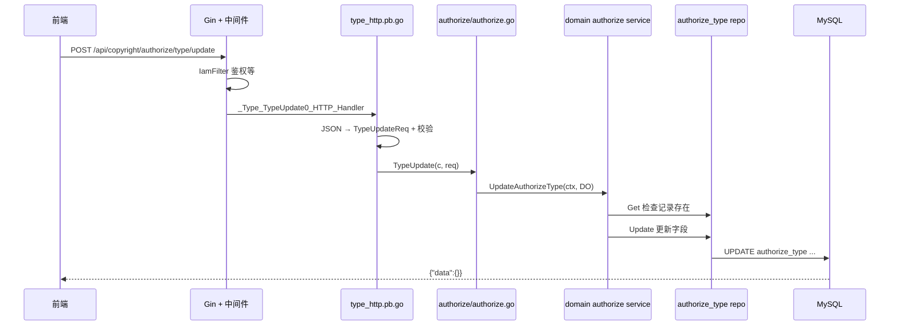

```
1. api/*_http.pb.go pb.go的文件是干嘛的？自动生成的吗？我需要关心里面的具体内容吗？

2. IamFilter 鉴权是怎么做的？是在哪一步做的   ？
   
3. authorize.RegisterTypeHTTPServerController(routerGroup, srv.authorizeServer)；把 `authorizeServer` 注册到 Gin？Gin是什么？
   
4. infra中的文件是用来做什么的
5. DTO、DO、PO
```

- authorize_type： 授权类型配置表
- repeated： 是 Protocol Buffers（protobuf） 里的关键字，表示这个字段是 数组 / 列表，可以出现 0 个、1 个或多个 同类型元素。
- optional：

下面用 `/api/copyright/authorize/type/update` 做例子，给你一套**从前端请求反查后端**的通用读代码方法。这个接口链路比较短，很适合入门。

---

## 一、先建立整体心智模型

可以把一次 HTTP 请求想成一条流水线：

```
前端 POST
  → Gin 路由（谁接这个 URL）
  → 中间件（鉴权、日志、trace）
  → 解析 JSON → DTO（TypeUpdateReq）
  → 参数校验
  → Service 层（应用编排）
  → Domain 层（业务规则）
  → Repository（数据库操作）
  → 返回 JSON
```

对应本项目目录：

| 层次      | 目录                                             | 你要关心什么                 |
| ------- | ---------------------------------------------- | ---------------------- |
| 接口定义    | `api/`                                         | URL、请求/响应字段、校验规则       |
| HTTP 入口 | `api/*_http.pb.go`（生成）                         | 怎么解析 body、怎么调 Service  |
| 应用层     | `internal/app/service/`                        | 把 DTO 转成 DO，调领域服务      |
| 组装器     | `internal/app/service/assembler/`              | DTO ↔ DO 转换（本接口**没用**） |
| 领域层     | `internal/domain/`                             | **真正的业务逻辑**            |
| 仓储      | `internal/infra/repository/impl/`              | SQL / 数据库读写            |
| 表结构     | `internal/infra/repository/persistence/mysql/` | 字段和表名                  |

---

## 二、这个接口的完整调用链



---

## 三、推荐阅读顺序（按这个顺序看）

### 第 1 步：接口契约 — 前端和后端的「合同」

**文件：** `api/authorize/type.proto`

重点看：
- `rpc TypeUpdate` → URL 是 `POST /api/copyright/authorize/type/update`
- `message TypeUpdateReq` → 前端要传哪些字段
- `validate.rules` → 后端校验规则（如 `id > 0`，名称 1–20 字）

```97:106:api/authorize/type.proto
message TypeUpdateReq {
    // 二级授权类型id
    int64 id = 1 [(validate.rules).int64 = {gt: 0}];
    // 二级授权类型名字
    string sub_authorize_name = 2 [(validate.rules).string = {min_len: 1, max_len: 20}];
    // 关联权利项
    repeated int64 related_rights = 3;
    // 类型说明
    optional string remark = 4;
}
```

**怎么看：** 对照前端请求体，字段名一般是 snake_case（`sub_authorize_name`），和前端 JSON 一致。

**可跳过：** `type.pb.go`、`type.pb.validate.go`（proto 生成，改 proto 后 `make api` 再生）。

---

### 第 2 步：HTTP 入口 — 请求怎么进来

**文件：** `api/authorize/type_http.pb.go`

重点函数：`_Type_TypeUpdate0_HTTP_Handler`（约 171 行）

看它做了什么：
1. 读 `Request.Body`
2. 反序列化成 `TypeUpdateReq`
3. `validateWithProtovalidate` 校验
4. 调 `srv.TypeUpdate(c, &in)`
5. 把结果包成 `{"data": ...}` 写回

**怎么看：** 这是「框架层」，多数接口模式相同，看懂一个即可。

**可跳过：** `type_grpc.pb.go`（除非走 gRPC）。

---

### 第 3 步：中间件 — 鉴权在哪

**文件：** `cmd/platform-copyright/http.go`

全局中间件链里有 `middleware.IamFilter`（IAM 鉴权），在路由处理之前执行。

**怎么看：** 接口 401/403 时，先查这里和 `internal/infra/middleware/`。

---

### 第 4 步：路由注册 — 谁实现了这个接口

**文件：** `internal/server/http.go`

```93:93:internal/server/http.go
	authorize.RegisterTypeHTTPServerController(routerGroup, srv.authorizeServer)
```

把 `authorizeServer` 注册到 Gin。实现类在下一步。

依赖注入在 `cmd/platform-copyright/wire_gen.go`：

```go
typeHTTPServerController := service8.NewAuthorizeTypeService(authorizeDomainer)
```

**怎么看：** 知道「接口 → 具体 struct」即可，wire 文件一般不用细读。

---

### 第 5 步：应用 Service — 你要重点看的第一份手写代码

**文件：** `internal/app/service/authorize/authorize.go`

**函数：** `TypeUpdate`（约 73 行）

```73:86:internal/app/service/authorize/authorize.go
func (s *authorizeTypeService) TypeUpdate(c *gin.Context, req *authorize.TypeUpdateReq) (*authorize.TypeUpdateResp, error) {
	ctx := c.Request.Context()
	_, err := s.authorizeDomainService.UpdateAuthorizeType(ctx, &entity.AuthorizeTypeUpdateReq{
		Id:            req.GetId(),
		Name:          req.GetSubAuthorizeName(),
		Remark:        req.GetRemark(),
		RelatedRights: req.GetRelatedRights(),
		UpdateAt:      time.Now().Unix(),
	})
	// ...
}
```

**重点关注：**
- DTO（`TypeUpdateReq`）→ DO（`AuthorizeTypeUpdateReq`）的字段映射
- 本接口**没有走 assembler**，是 Service 里直接转的（简单写操作常见）
- 业务逻辑不在这里，只是「转发 + 记日志」

---

### 第 6 步：领域 Service — 业务逻辑核心

**文件：** `internal/domain/copyright/authorize/service/authorize.go`

**函数：** `UpdateAuthorizeType`（约 329 行）

```329:349:internal/domain/copyright/authorize/service/authorize.go
func (s *authorizeDomainService) UpdateAuthorizeType(ctx context.Context, req *entity2.AuthorizeTypeUpdateReq) (int64, error) {
	_, err := s.checkTopAuthorizeType(ctx, req.Id)
	if err != nil {
		return 0, err
	}
	opts := []repository.Option{
		repository.WithCols("name", "remark", "related_rights", "updated_at"),
		repository.WithEqId(req.Id),
		repository.WithCondition("is_all = ?", metadata.IntNo),
	}
	affected, err := s.authorizeTypeRepo.Update(ctx, &entity2.AuthorizeType{
		Name:          req.Name,
		Remark:        req.Remark,
		RelatedRights: req.RelatedRights,
		UpdatedAt:     req.UpdateAt,
	}, opts...)
	// ...
}
```

**重点关注：**
1. `checkTopAuthorizeType`：先查 id 是否存在，不存在返回业务错误
2. `WithCols(...)`：只更新这 4 个字段（**不能改 status**，改状态走 `/operate`）
3. `is_all = 0`：**「全类型」记录不允许通过这个接口改**

**怎么看：** 改接口行为、加校验、理解「为什么更新失败」，主要看这一层。

---

### 第 7 步：实体定义 — 数据结构

**文件：** `internal/domain/copyright/authorize/entity/authorize.go`

看 `AuthorizeType`、`AuthorizeTypeUpdateReq` 有哪些字段。

---

### 第 8 步：数据库层 — 最后落地

| 文件 | 作用 |
|------|------|
| `internal/domain/copyright/authorize/repo/c_facade/authorize.go` | Repo **接口**（领域层只依赖接口） |
| `internal/infra/repository/impl/authorize_type.go` | **实现**：`Update` 用 XORM 执行 SQL |
| `internal/infra/repository/persistence/mysql/authorize_type.go` | **表结构** PO |

表字段示例：`name`、`remark`、`related_rights`（JSON）、`is_all`、`status` 等。

---

## 四、哪些重点看、哪些可以跳过

### 必看（按优先级）

1. **`*.proto`** — 接口文档，和前端最直接相关  
2. **`internal/app/service/{模块}/{模块}.go`** — 入口 handler 方法  
3. **`internal/domain/{模块}/service/*.go`** — 业务规则  
4. **`entity/*.go`** — 领域数据结构  

### 看懂模式后可略读

- `*_http.pb.go` — 生成代码，模式固定  
- `wire_gen.go` — 依赖注入  
- `provider_set.go` — 注册有哪些 Service  

### 需要时再查

- `assembler/` — 列表、选项类接口常用；本 update 没用  
- `*_test.go` — 看用例理解边界  
- `internal/infra/middleware/` — 鉴权、日志问题  

---

## 五、实用技巧：以后怎么自己追任意接口

### 技巧 1：从 URL 反查

在项目根目录搜索路径片段：

```bash
rg "authorize/type/update" 
# 或
rg "TypeUpdate"
```

通常会命中 `type.proto` 和 `type_http.pb.go`。

### 技巧 2：从 RPC 名追实现

proto 里 `rpc TypeUpdate` → 搜 `func (s *xxx) TypeUpdate` → 找到 `internal/app/service/authorize/authorize.go`。

### 技巧 3：IDE「跳转到实现」

在 `TypeHTTPServerController` 接口的 `TypeUpdate` 上跳转，会直接到 Service 实现。

### 技巧 4：对比「读」和「写」接口

| 接口 | 特点 |
|------|------|
| `TypeList` | 用 **assembler** 做 DTO↔DO，组装展示字段 |
| `TypeUpdate` | Service **直接映射**，逻辑在 domain |

列表类多看 assembler；增删改多看 domain service。

### 技巧 5：看错误从哪来

- 参数错误（44010102）→ `type_http.pb.go` 校验  
- 业务错误（如「授权类型不存在」）→ `domain/service` 里 `meta.Err49999999`  
- 系统错误（47010101）→ HTTP handler 兜底  

---

## 六、这个接口的一句话总结

前端 POST `{ id, sub_authorize_name, related_rights, remark }`  
→ 校验通过后，Service 转成领域对象  
→ Domain 先确认记录存在，再更新 `name/remark/related_rights/updated_at`（且 `is_all` 必须为 0）  
→ Repo 写 MySQL `authorize_type` 表  
→ 返回空 `data`。

---

如果你愿意，我可以再用同一个方法带你走一遍 **`/authorize/type/list`**（会经过 assembler，和 update 对比着看更容易建立完整图景）。