> 审核项目后端 项目介绍[https://x0sgcptncj.feishu.cn/wiki/S0Pxw0dm8i4EfbkLDItcZrk1nsf]
- 后台：`backend/web/index-dev.php` 这是给审核后台用的
- API：`api/web/index-dev.php` 这是提供给外部用的API服务（专辑、章节、短剧等接口）
```
1. DTS同步是什么意思？
2. common/services和common/libraries
这两个文件夹内的文件分别是用来做什么的？为什么不在backend/controllers中写？
3. common/models这个文件下文件是用来做什么的？models是什么怎么用？

4. common/models/Playlets.php 中rules和attributeLabels是用来做什么的？怎么用？ORM 层是什么意思？保证 ActiveRecord 能正确读写新列，ActiveRecord是什么意思？
5. Kafka 扩展是什么
6. ecs和k8s是什么？有什么区别？怎么用？
7. supervisor是什么？rabbitMq是什么？怎么用？
8. Repository 批量查询是为了做什么？
9. 禁词误伤日志为为什么由同步写ClickHouse改为`pushCustomLog`（异步队列）？什么是ClickHouse，什么是pushCustomLog（异步队列）？
   
   
   禁词误伤日志写入方式变化

  

旧：同步直写 ClickHouse chapter_log

新：先入 operationLogQueue，再由 OperationLogJob 异步写

  

为什么要这样做？
```
## 如何运行
- 安装php：brew install php@7.4
- 安装nginx：brew install nginx
- 安装composer：brew install composer
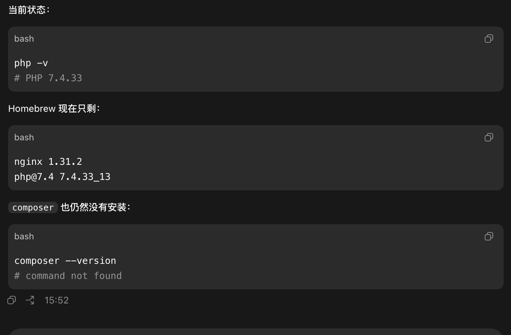
## 修改nginx配置
在`/opt/homebrew/etc/nginx/servers`下增加：
- api-shenhe.km.com
```
server {
    listen 80;
    server_name api-shenhe.km.com api.shenhe.com;
    root /Users/staff/Documents/workspace/tools/workspace/workstree/feature-baijiahao-video-pre-admin-adjust/shenhe-php/api/web/;
    index index-dev.php;
    error_log /tmp/shenhe.api.error.log;

    client_max_body_size 100M;

    location / {
        if (!-e $request_filename){
             rewrite ^/(.*) /index-dev.php?r=$1 last;
        }
    }

    location ~ \.php$ {
        fastcgi_pass 127.0.0.1:9000;
        fastcgi_index index-dev.php;
        fastcgi_split_path_info ^(.+\.php)(.*)$;
        include fastcgi_params;
        fastcgi_param SCRIPT_FILENAME $document_root$fastcgi_script_name;
    }

    # HTTPS：mkcert 生成证书后取消注释
    # listen 443 ssl;
    # ssl_certificate     /path/to/shenhe.km.com.pem;
    # ssl_certificate_key /path/to/shenhe.km.com-key.pem;
}


```
- shenhe.km.com
```
server {
    listen 80;
    server_name shenhe.km.com admin.shenhe.com;
    root /Users/staff/Documents/workspace/tools/workspace/workstree/feature-baijiahao-video-pre-admin-adjust/shenhe-php/backend/web;
    index index-dev.php;
    error_log /tmp/shenhe.backend.error.log;

    client_max_body_size 100M;

    location / {
        if (!-e $request_filename){
             rewrite ^/(.*) /index-dev.php?r=$1 last;
        }
    }

    # location /static/ {
    #    proxy_pass  https://static/static/;
    #    proxy_redirect     off;
    #    proxy_set_header   Host             $host;
    #    proxy_set_header   X-Real-IP        $remote_addr;
    #    proxy_set_header   X-Forwarded-For  $proxy_add_x_forwarded_for;
    #    proxy_next_upstream error timeout invalid_header http_500 http_502 http_503 http_504;
    #    proxy_max_temp_file_size 0;
    #    proxy_connect_timeout      90;
    #    proxy_send_timeout         90;
    #    proxy_read_timeout         90;
    #    proxy_buffer_size          4k;
    #    proxy_buffers              4 32k;
    #    proxy_busy_buffers_size    64k;
    #    proxy_temp_file_write_size 64k;
    # }

    # location /front/ {
    #     proxy_pass  https://static/front/;
    #     proxy_redirect     off;
    #     proxy_set_header   Host             $host;
    #     proxy_set_header   X-Real-IP        $remote_addr;
    #     proxy_set_header   X-Forwarded-For  $proxy_add_x_forwarded_for;
    #     proxy_next_upstream error timeout invalid_header http_500 http_502 http_503 http_504;
    #     proxy_max_temp_file_size 0;
    #     proxy_connect_timeout      90;
    #     proxy_send_timeout         90;
    #     proxy_read_timeout         90;
    #     proxy_buffer_size          4k;
    #     proxy_buffers              4 32k;
    #     proxy_busy_buffers_size    64k;
    #     proxy_temp_file_write_size 64k;
    # }

    location ~ \.php$ {
        fastcgi_pass 127.0.0.1:9000;
        fastcgi_index index-dev.php;
        fastcgi_split_path_info ^(.+\.php)(.*)$;
        include fastcgi_params;
        fastcgi_param SCRIPT_FILENAME $document_root$fastcgi_script_name;
    }

    # HTTPS：mkcert 生成证书后取消注释
    # listen 443 ssl;
    # ssl_certificate     /path/to/shenhe.km.com.pem;
    # ssl_certificate_key /path/to/shenhe.km.com-key.pem;
}

```
另外/opt/homebrew/etc/nginx/nginx.conf 这个文件下的端口号要修改下可以改成`80`，默认http的server是`8080`端口很容易被占用。还要加一句`include servers/*;`这样在 `servers/` 下新建的 `.conf` 会被 Nginx 自动加载。
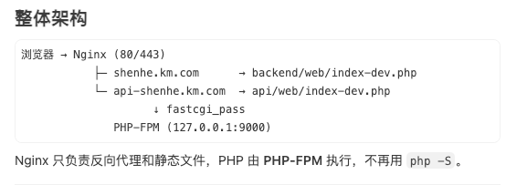

### 修改host
当前域名指向测试环境 IP，会绕过本机 Nginx：
```
139.224.227.190 shenhe.km.com
139.224.227.190 api-shenhe.km.com
```
改为：
```
127.0.0.1 shenhe.km.com
127.0.0.1 api-shenhe.km.com

或者
127.0.0.1 admin.shenhe.com
127.0.0.1 api.shenhe.com
```
### 启动服务
```
# 启动 PHP-FPM 服务（PHP 7.4 版本）
brew services start php@7.4

# 检查配置并重载 Nginx（注释行，说明后续操作目的）

# 验证 Nginx 的配置文件语法是否正确
/opt/homebrew/bin/nginx -t 
# 或者
nginx -t

# 列出所有通过 Homebrew 管理的服务及其运行状态
brew services list

# 启动 Nginx 服务（如果尚未运行）
brew services start nginx

# 或修改配置后：
brew services restart nginx
```
验证：
```
lsof -i :9000 # PHP-FPM 应在监听

lsof -i :80 # Nginx 应在监听

curl -I http://shenhe.km.com
```

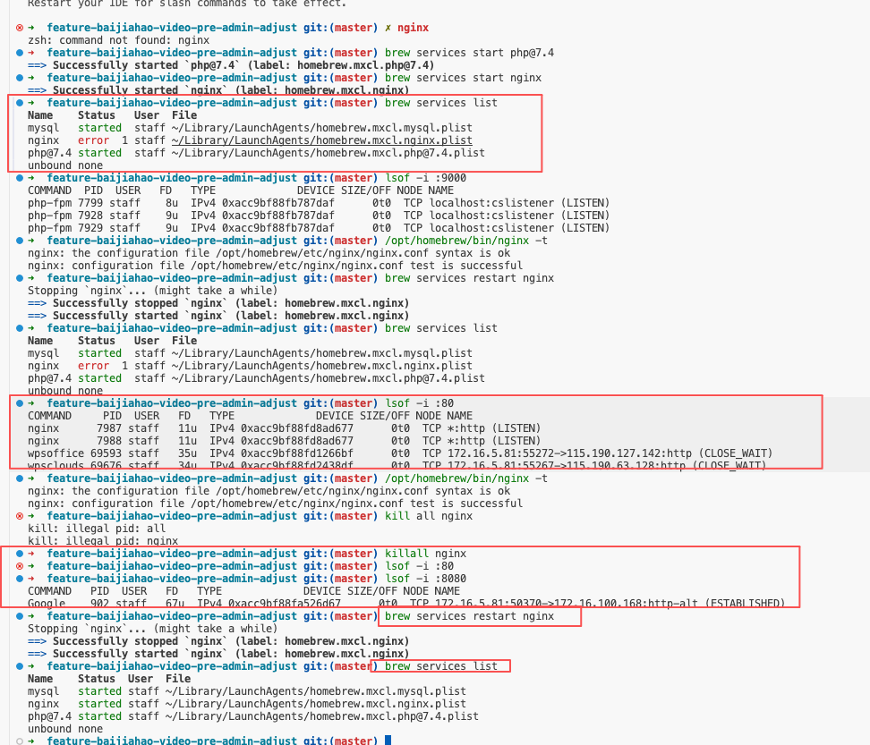
##### SSL 证书
先不管，访问的时候把https改为http就行了

### apifox
做到这一步的时候，你已经可以通过apifox来访问本地的接口了。通过curl复制接口。
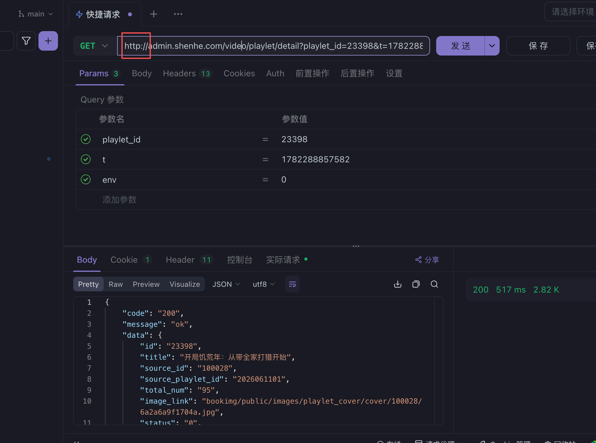

### proxy
如果你想在本地的前端项目中调试服务端的接口，改这里
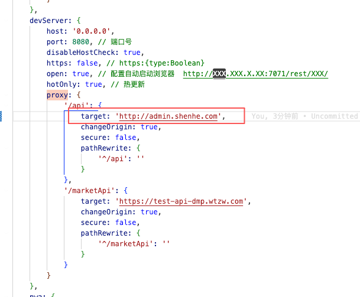

## 访问
ModHeader 插件修改请求标头
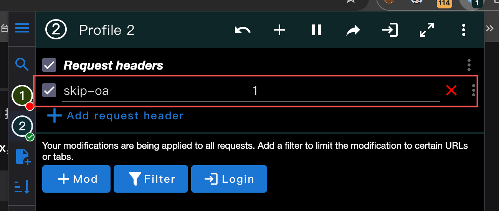


## 数据库配置
- 主 MySQL：`book_shuku`  
    配置组件：`db`  
    位置：[common/config/main-dev.php (line 5)](/Users/staff/Documents/workspace/tools/workspace/workstree/feature-baijiahao-video-pre-admin-adjust/shenhe-php/common/config/main-dev.php:5)
    
- 授权 MySQL：`shuku_auth`  
    配置组件：`dmpauth`  
    位置：[common/config/main-dev.php (line 16)](/Users/staff/Documents/workspace/tools/workspace/workstree/feature-baijiahao-video-pre-admin-adjust/shenhe-php/common/config/main-dev.php:16)
    
- ADB/分析库：`book_shuku`  
    配置组件：`adb`  
    位置：[common/config/main-dev.php (line 28)](/Users/staff/Documents/workspace/tools/workspace/workstree/feature-baijiahao-video-pre-admin-adjust/shenhe-php/common/config/main-dev.php:28)
另外还会连 MongoDB、Redis、ES、RabbitMQ 等。数据库主机、账号密码不是写死在配置里，而是从 `.env.dev` 这类环境文件读取，比如 `DB_HOST`、`DB_PORT`、`DB_USERNAME`、`DB_PASSWORD`。


## 服务端审核项目介绍
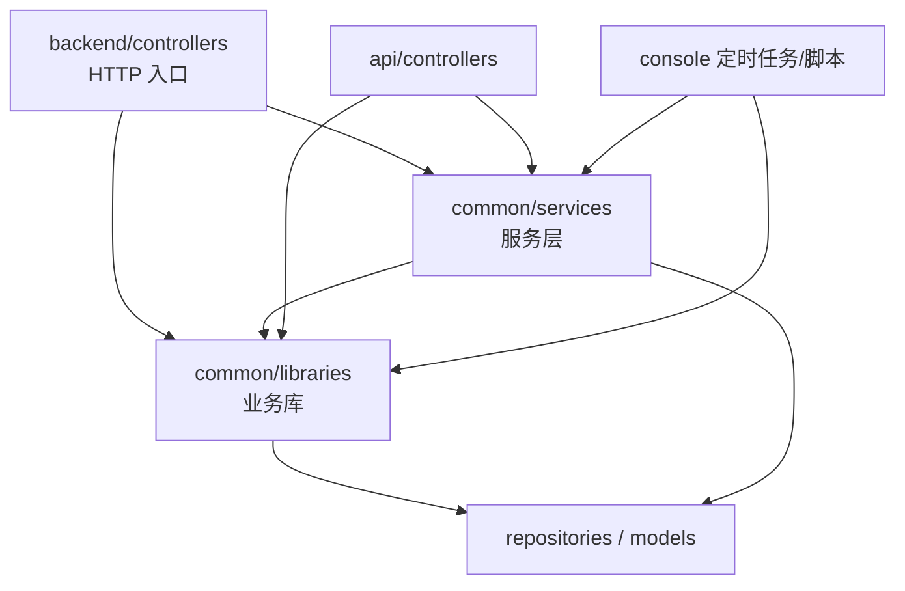


### 1. 多应用共享

项目是 `backend` + `api` + `console` 三端结构。业务逻辑放 `common`，才能：

- `backend/controllers/video/PlayletController` — 后台管理
- `api/controllers/PlayletController` — 内部 API
- `console/controllers/cron/PlayletController` — 定时任务

共用同一套 `PlayletLib`，避免复制粘贴三份逻辑。

### 2. Controller 应保持「薄」

`BaseController` 已经承担了鉴权、响应格式、导出任务投递等 Web 层职责。Controller 再塞几千行业务代码会导致：

- 单文件膨胀（`PlayletController` 已 1700+ 行，主要是参数和响应组装）
- HTTP 细节与业务逻辑缠在一起，难以测试和维护

理想分工：

|层|做什么|不做什么|
|---|---|---|
|Controller|取参、校验、调 Lib/Service、格式化 JSON|复杂 DB 操作、跨表事务、队列细节|
|Library|领域业务规则、数据组装|关心 HTTP Header、Session|
|Service|完整流程、Job、可插拔能力|路由、权限|

### 3. 异步任务无法写在 Controller

像 `PlayletUploadExportLib`（导出）、`UploadPlayletService`（上传）会被队列消费者或 CLI 直接调用，根本没有 HTTP 请求，自然不能放在 Controller 里。

### 4. 可测试性与演进

Lib/Service 不依赖 `Yii::$app->request`，更容易单测；换接口形态（REST → 队列 → 脚本）时，业务层不用动。


这次改动的核心是：给短剧补上**横版封面**（`width_image_link`）和**可免费观看集数**（`free_video_num`），并在编辑、ZIP 新增上传、CSV 批量修改三条入口里统一校验与落库。下面按「新手能看懂」的方式给你 CR 阅读指南。

---

## 一、先建立全局认知（5 分钟）

建议先读开发文档的这几节，不用逐字啃完全文：

| 章节 | 看什么 |
|------|--------|
| **一、背景理解** | 为什么要做 |
| **二、需求目标** | 8 条验收标准 |
| **四、影响范围** | 改了哪些文件 |
| **六、接口设计** | 详情 / 保存接口字段与校验 |
| **七、上传设计** | ZIP 目录、`info.csv` 列序 |

文档路径：`doc/playlet_width_image_free_video_num_development_plan.md`

**一句话总结**：数据库 `playlet` 表加 2 个字段；详情接口读出来并拼 CDN URL；保存 / 批量修改要校验；ZIP 上传从 `horizontal_images/` 解析横版封面。

---

## 二、推荐阅读顺序（由底向上）

新手建议按「数据 → 模型 → 核心逻辑 → 入口 → 样例」读，而不是从 Controller 开始。

```
第 0 步：开发文档（建立需求锚点）
    ↓
第 1 步：SQL 迁移（数据长什么样）
    ↓
第 2 步：Playlets.php（模型是否声明新字段）
    ↓
第 3 步：PlayletVideosRepo.php（「有效集数」怎么算）
    ↓
第 4 步：PlayletLib.php（核心业务：校验 + 详情 + 保存）
    ↓
第 5 步：UploadPlayletService.php（ZIP 上传解析）
    ↓
第 6 步：PlayletMultiModifyLib.php（CSV 批量修改）
    ↓
第 7 步：PlayletController.php（HTTP 入口，对照接口）
    ↓
第 8 步：LogPlaylets.php（操作日志，扫一眼即可）
```

### 为什么要这个顺序？

Yii2 这个项目大致是：

```
HTTP 请求 → Controller（收参、基础校验）
         → Lib / Service（业务逻辑）
         → Model / Repo（读写数据库）
         → MySQL / OSS
```

**从下往上读**，你先知道「数据存哪、规则是什么」，再看 Controller 就只是在「接线」，不会迷失在参数列表里。

---

## 三、每个文件看什么、怎么看

### 1. `console/sql/20260626_playlet_width_image_free_video_num.sql`（2 分钟）

只看 DDL：

- `width_image_link`：varchar，默认 `''`，存 OSS 路径（不是完整 URL）
- `free_video_num`：smallint unsigned，默认 `0`

`production`（制作成本）**不在** `playlet` 表，在 `playlet_filings` 表，本期只是加「必填校验」。

---

### 2. `common/models/Playlets.php`（3 分钟）

对照检查：

- `@property` 有没有新字段
- `rules()` 里类型、长度是否对
- `attributeLabels()` 中文名是否对

这是 ORM 层，保证 ActiveRecord 能正确读写新列。

---

### 3. `common/repositories/PlayletVideosRepo.php`（5 分钟，重点）

重点看 `getValidVideoNumByPlayletId()`：

```53:59:common/repositories/PlayletVideosRepo.php
    public static function getValidVideoNumByPlayletId(int $playletId): int
    {
        return (int)PlayletVideos::find()
            ->where(['playlet_id' => $playletId])
            ->andWhere(['IS NOT', 'origin_url', null])
            ->andWhere(['!=', 'origin_url', ''])
            ->count();
    }
```

**业务口径**：有效集数 = `playlet_videos` 里 `origin_url` 非空的条数，**不是** `playlet.total_num`。

后面所有 `free_video_num` 校验都依赖这个方法，CR 时要确认口径一致。

---

### 4. `common/libraries/PlayletLib.php`（20–30 分钟，最重点）

按方法读，建议顺序：

| 方法 | 作用 | CR 关注点 |
|------|------|-----------|
| `getPlayletDetail()` | 详情返回 | `width_image_link` 是否像 `full_image_link` 一样拼 CDN；空值是否返回 `''` |
| `validateFreeVideoNum()` | 免费集数校验 | 空→0；非负整数；`>= 有效集数` 报错 |
| `save()` | 保存落库 | 是否调用校验；`dealImagePath()` 处理横版封面；`production` 写到 `playlet_filings` |

核心校验逻辑：

```562:579:common/libraries/PlayletLib.php
    public static function validateFreeVideoNum(int $playletId, $freeVideoNum): array
    {
        if ($freeVideoNum === null || $freeVideoNum === '') {
            return ['free_video_num' => 0];
        }
        // ... 非负整数校验 ...
        $validVideoNum = PlayletVideosRepo::getValidVideoNumByPlayletId($playletId);
        if ($freeVideoNum > 0 && $freeVideoNum >= $validVideoNum) {
            return ['msg' => '可免费观看集数必须小于总集数'];
        }
        return ['free_video_num' => $freeVideoNum];
    }
```

**边界 case 要心里有数**：

- 有效集数 = 0 时，只有 `free_video_num = 0` 能通过
- `free_video_num = 0` 始终合法

---

### 5. `common/services/upload/UploadPlayletService.php`（20 分钟，重点）

建议按调用链读：

```
process()
  → checkFolder()      # 检查 info.csv 存在
  → dealInfo()         # 逐行读 CSV
      → preProcess()   # 解析 row[13] production、row[21] free_video_num
      → processCover() # 遍历 coverTypeMap 上传 OSS
      → insertUploadLog() # 写入 playlet + playlet_filings
```

**本期改动 3 处**：

1. `$coverTypeMap` 新增 `horizontal_images`
2. `preProcess()`：`production` 先判空再 `floatval`（避免空串变 0）
3. `insertUploadLog()`：写 `width_image_link`、`free_video_num`

**CR 注意**：ZIP 上传里 `free_video_num` **只校验格式**（非负整数），**不**和有效集数比——上传时剧集往往还没入库，这是合理设计，但要和需求文档一致。

---

### 6. `common/libraries/tasks/PlayletMultiModifyLib.php`（15 分钟，重点）

批量修改是**异步任务**（Controller 只丢队列，真正逻辑在这里）。

重点看 `uploadHandle()` 里：

- `制作成本（单位：万元）`：必填 + 数字
- `可免费观看集数`：复用 `PlayletLib::validateFreeVideoNum()`
- 失败行写入失败 CSV（表头含 `可免费观看集数`）

---

### 7. `backend/controllers/video/PlayletController.php`（10 分钟）

只盯这几个 action，别通读 1700 行：

| Action | 路由 | 看什么 |
|--------|------|--------|
| `actionDetail` | GET `/video/playlet/detail` | 参数校验后调 `PlayletLib::getPlayletDetail` |
| `actionSave` | POST `/video/playlet/save` | `production` 必填；`width_image_link` 入参 |
| `actionUpload` | POST `/video/playlet/upload` | 解压 zip → `UploadPlayletService` |
| `actionMultiModifyUpload` | POST 批量修改 | 上传 CSV 到 OSS，创建异步任务 |
| `actionMultiModifySample` | GET 样例下载 | 表头是否含 `可免费观看集数` |

Controller 原则：**只做参数校验和转发**，业务应在 Lib/Service。

---

### 8. `common/models/log/LogPlaylets.php`（2 分钟，可跳过细读）

确认新字段进了操作日志白名单和中文文案即可。

---

## 四、哪些不用重点看

| 文件/内容 | 原因 |
|-----------|------|
| `data/example/短剧上传（案例模板）.zip` | 样例资源，确认有 `horizontal_images/` 和 `info.csv` 新列即可 |
| `data/example/.../*.jpg` | 示例图片，无逻辑 |
| `doc/playlet_width_image_free_video_num_development_plan.md` | 已读核心章节后，测试用例表可当 checklist |
| Controller 里无关的 action | 本期没动，不用看 |
| `PlayletSyncLib.php` | 若不在本次 diff 里，不用看 |

---

## 五、流程图（请求 → 数据流转）

### 路径 A：详情查询（读数据）

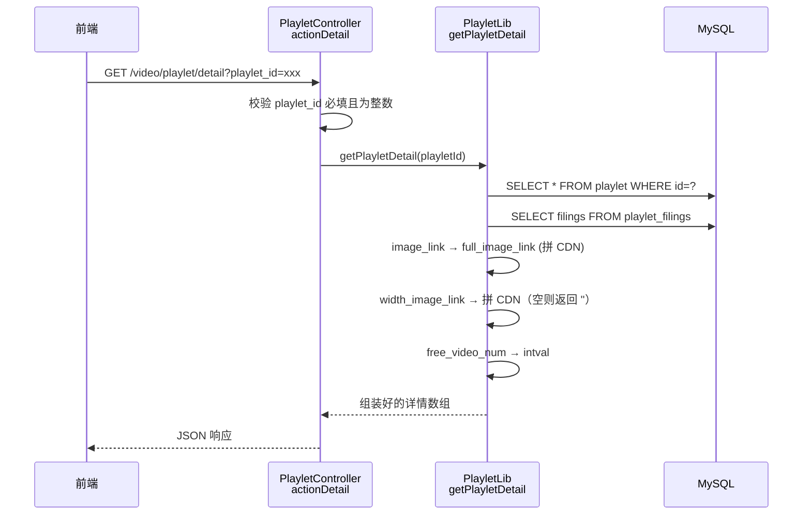

**数据形态**：

- DB 存：`width_image_link` = OSS 相对路径
- 接口返：CDN 完整 URL（和竖版封面 `full_image_link` 一致）

---

### 路径 B：编辑保存（写数据）

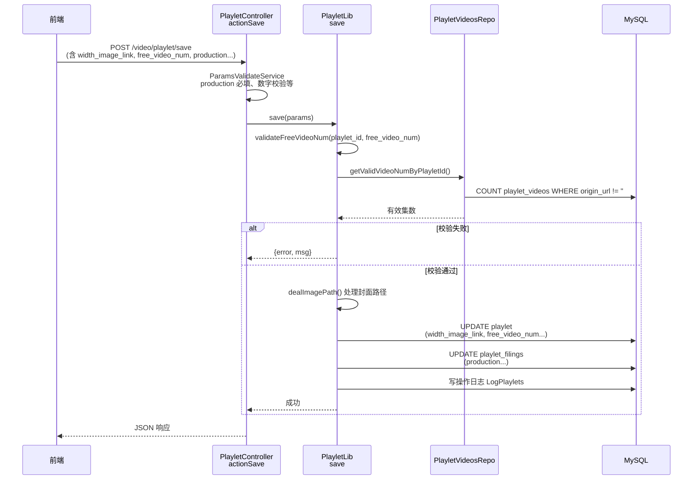

---

### 路径 C：ZIP 新增上传

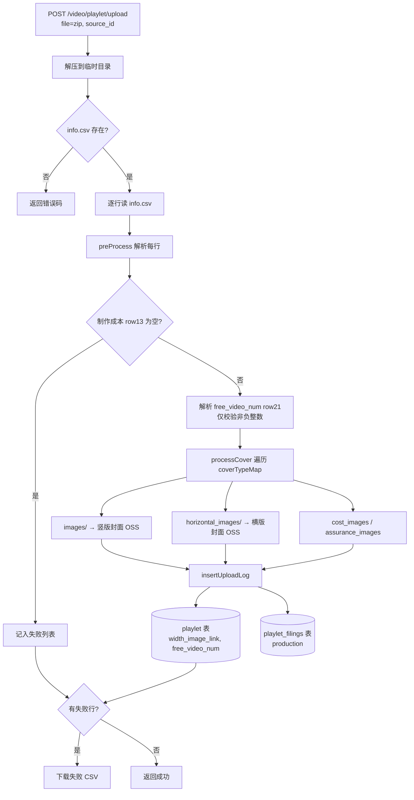

ZIP 目录结构（本期新增 `horizontal_images`）：

```
短剧上传.zip
├── info.csv              # 元数据，含制作成本、可免费观看集数
├── images/               # 竖版封面 {source_playlet_id}.jpg
├── horizontal_images/    # 横版封面（本期新增）
├── cost_images/
├── assurance_images/
└── videos/ ...
```

---

### 路径 D：CSV 批量修改（异步）

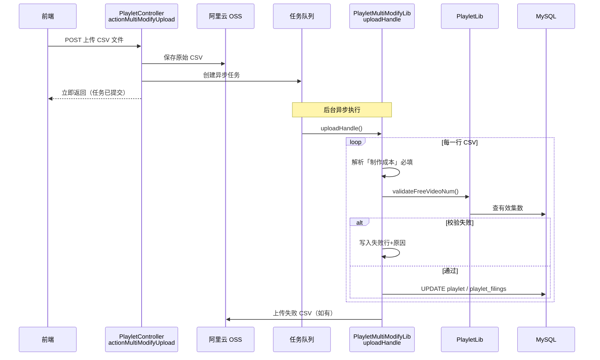

---

## 六、CR 检查清单（按优先级）

做人工 CR 时，建议逐项勾：

### 高优先级（必看）

1. **`free_video_num` 校验口径**：保存、批量修改是否都用 `PlayletVideosRepo::getValidVideoNumByPlayletId`，而不是 `total_num`
2. **`production` 必填**：`actionSave`、`preProcess`（ZIP）、`PlayletMultiModifyLib` 三处是否一致；ZIP 是否修复了「空串被 `floatval` 变成 0」的 bug
3. **CDN vs OSS 路径**：DB 存 path，详情接口拼 CDN；`dealImagePath()` 入库时是否去掉 CDN 前缀
4. **CSV 列索引**：`info.csv` 的 `row[21]`（免费集数）、`row[13]`（制作成本）是否与模板、文档一致
5. **`horizontal_images` 命名**：是否为 `{source_playlet_id}.jpg`，和竖版封面规则一致

### 中优先级

6. 边界：`有效集数=0` 时 `free_video_num>0` 应失败
7. ZIP 上传不校验「免费集数 < 总集数」是否符合预期
8. 操作日志 `LogPlaylets` 新字段是否记录

### 低优先级

9. 样例 zip/csv 是否与代码解析一致
10. Model `rules()` 是否足够（业务校验多在 Lib 层也正常）

---

## 七、给服务端新手的阅读技巧

1. **先找入口**：Controller 的 `actionXxx` = 接口名
2. **跟一次调用链**：`actionSave` → `PlayletLib::save` → `Model::save` / `Repo::getXxx`
3. **区分「格式校验」和「业务校验」**：
   - Controller / `ParamsValidateService`：必填、类型、长度
   - Lib：`free_video_num < 有效集数` 这类业务规则
4. **看返回值约定**：`['error' => code, 'msg' => '...']` 表示失败；`[]` 或 `['data' => ...]` 表示成功
5. **用 git diff 缩小范围**：`git diff common/libraries/PlayletLib.php`，只看 `+/-` 行

```bash
# 建议你在本地跑
git diff --stat
git diff common/libraries/PlayletLib.php
git diff common/services/upload/UploadPlayletService.php
```

---

如果你愿意，我可以下一步按某一条路径（比如只审 `actionSave`）帮你做一版「逐行 CR 注释」，或者根据 `git diff` 标出每个 `+` 行该不该 merge。


## 遇到的问题1
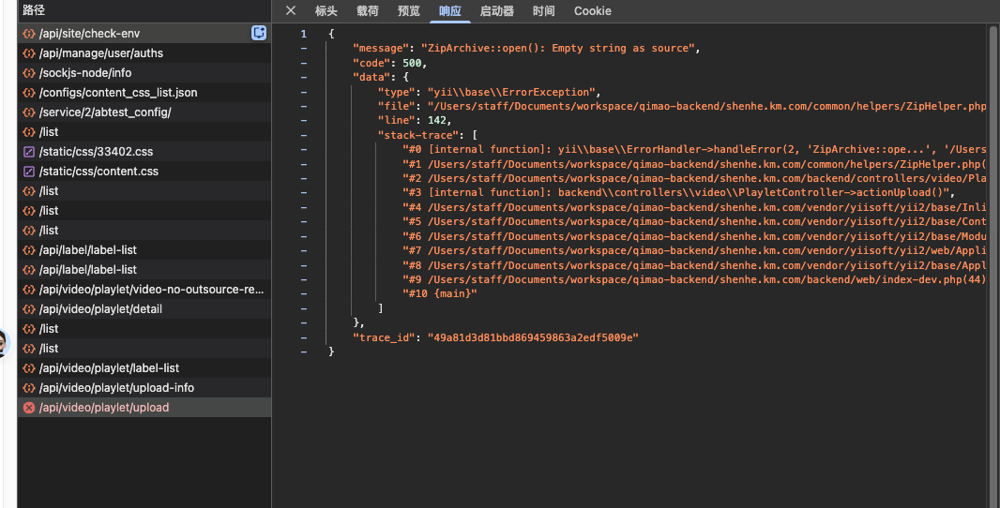

ai建议可以看下日志
```
$_FILES['file']['error']
$_FILES['file']['tmp_name']
```
最简单有两种看法。

**方式 1：浏览器 Network 看请求**  
打开 DevTools → Network → 点 `/api/video/playlet/upload` → 看 `Payload` / `Request Payload` / `Form Data`，只能确认有没有 `file` 字段，但通常看不到 PHP 生成的 `error/tmp_name`。所以这个方式不够直接。

**方式 2：后端临时打日志，推荐**  
在 [backend/controllers/video/PlayletController.php (line 190)](/Users/staff/Documents/workspace/qimao-backend/shenhe.km.com/backend/controllers/video/PlayletController.php:190) 这一段后面临时加：

```
$uploadFile = UploadedFile::getInstanceByName('file');

Yii::error([
    '_FILES_file' => $_FILES['file'] ?? null,
    'uploadFile' => $uploadFile ? [
        'name' => $uploadFile->name,
        'tempName' => $uploadFile->tempName,
        'size' => $uploadFile->size,
        'error' => $uploadFile->error,
        'hasError' => $uploadFile->hasError,
        'type' => $uploadFile->type,
    ] : null,
], 'playlet-upload-debug');
```

然后重新上传一次，再看日志：

```
tail -200 backend/runtime/logs/error/2026-06-26.log
```

重点看：

```
$_FILES['file']['error']
$_FILES['file']['tmp_name']
```

常见结果：

```
error = 0
tmp_name = /private/var/tmp/phpxxxx
```

说明 PHP 接收成功。

```
error = 1
tmp_name = ''
```

说明超过 `upload_max_filesize`。

```
error = 2
tmp_name = ''
```

说明超过表单里的 `MAX_FILE_SIZE`。

```
error = 3
```

只上传了一部分。

```
error = 6 或 7
```

临时目录/写入失败。

也可以用更粗暴的临时方式直接返回：

```
return [
    'files' => $_FILES,
    'uploadFile' => $uploadFile ? [
        'name' => $uploadFile->name,
        'tempName' => $uploadFile->tempName,
        'size' => $uploadFile->size,
        'error' => $uploadFile->error,
        'hasError' => $uploadFile->hasError,
    ] : null,
];
```

但这个会中断上传流程，只适合本地临时排查。

## 遇到的问题2
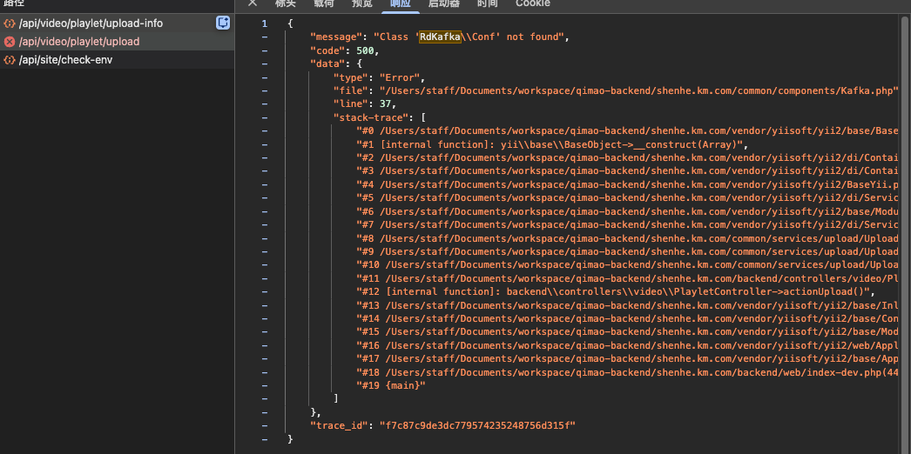
```
{
    "message": "Class 'RdKafka\\Conf' not found",
    "code": 500,
    "data": {
        "type": "Error",
        "file": "/Users/staff/Documents/workspace/qimao-backend/shenhe.km.com/common/components/Kafka.php",
        "line": 37,
        "stack-trace": [
            "#0 /Users/staff/Documents/workspace/qimao-backend/shenhe.km.com/vendor/yiisoft/yii2/base/BaseObject.php(109): common\\components\\Kafka->init()",
            "#1 [internal function]: yii\\base\\BaseObject->__construct(Array)",
            "#2 /Users/staff/Documents/workspace/qimao-backend/shenhe.km.com/vendor/yiisoft/yii2/di/Container.php(400): ReflectionClass->newInstanceArgs(Array)",
            "#3 /Users/staff/Documents/workspace/qimao-backend/shenhe.km.com/vendor/yiisoft/yii2/di/Container.php(159): yii\\di\\Container->build('common\\\\componen...', Array, Array)",
            "#4 /Users/staff/Documents/workspace/qimao-backend/shenhe.km.com/vendor/yiisoft/yii2/BaseYii.php(365): yii\\di\\Container->get('common\\\\componen...', Array, Array)",
            "#5 /Users/staff/Documents/workspace/qimao-backend/shenhe.km.com/vendor/yiisoft/yii2/di/ServiceLocator.php(137): yii\\BaseYii::createObject(Array)",
            "#6 /Users/staff/Documents/workspace/qimao-backend/shenhe.km.com/vendor/yiisoft/yii2/base/Module.php(742): yii\\di\\ServiceLocator->get('playletUploadKa...', true)",
            "#7 /Users/staff/Documents/workspace/qimao-backend/shenhe.km.com/vendor/yiisoft/yii2/di/ServiceLocator.php(74): yii\\base\\Module->get('playletUploadKa...')",
            "#8 /Users/staff/Documents/workspace/qimao-backend/shenhe.km.com/common/services/upload/UploadPlayletService.php(500): yii\\di\\ServiceLocator->__get('playletUploadKa...')",
            "#9 /Users/staff/Documents/workspace/qimao-backend/shenhe.km.com/common/services/upload/UploadPlayletService.php(141): common\\services\\upload\\UploadPlayletService->insertUploadLog(Array, Array)",
            "#10 /Users/staff/Documents/workspace/qimao-backend/shenhe.km.com/common/services/upload/UploadPlayletService.php(64): common\\services\\upload\\UploadPlayletService->dealInfo()",
            "#11 /Users/staff/Documents/workspace/qimao-backend/shenhe.km.com/backend/controllers/video/PlayletController.php(204): common\\services\\upload\\UploadPlayletService->process()",
            "#12 [internal function]: backend\\controllers\\video\\PlayletController->actionUpload()",
            "#13 /Users/staff/Documents/workspace/qimao-backend/shenhe.km.com/vendor/yiisoft/yii2/base/InlineAction.php(57): call_user_func_array(Array, Array)",
            "#14 /Users/staff/Documents/workspace/qimao-backend/shenhe.km.com/vendor/yiisoft/yii2/base/Controller.php(157): yii\\base\\InlineAction->runWithParams(Array)",
            "#15 /Users/staff/Documents/workspace/qimao-backend/shenhe.km.com/vendor/yiisoft/yii2/base/Module.php(528): yii\\base\\Controller->runAction('upload', Array)",
            "#16 /Users/staff/Documents/workspace/qimao-backend/shenhe.km.com/vendor/yiisoft/yii2/web/Application.php(103): yii\\base\\Module->runAction('video/playlet/u...', Array)",
            "#17 /Users/staff/Documents/workspace/qimao-backend/shenhe.km.com/vendor/yiisoft/yii2/base/Application.php(386): yii\\web\\Application->handleRequest(Object(yii\\web\\Request))",
            "#18 /Users/staff/Documents/workspace/qimao-backend/shenhe.km.com/backend/web/index-dev.php(44): yii\\base\\Application->run()",
            "#19 {main}"
        ]
    },
    "trace_id": "f7c87c9de3dc779574235248756d315f"
}
```


本期主要完成：
1. 【短剧信息编辑页面】新增字段
	1. 横屏封面 ：为空兜底为竖版封面自动拉伸（16:9）
		1. 1. 比例16:9和最小尺寸660x370严格限制
		2. 图片尺寸和文件大小暂时没有限制格式是jpg，和封面一样
	2. 免费集数：~~为空时阻断短剧创建流程~~（非必填）
2.  制作成本改为必填
	1. 短剧信息页面入口
		1. 为空：【制作成本不能为空】
	2. 批量上传短剧入口
		1. 为空：【制作成本不能为空】