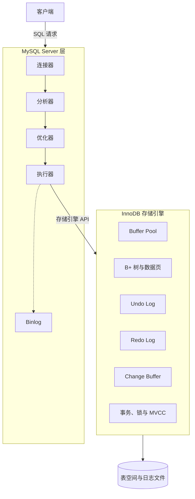
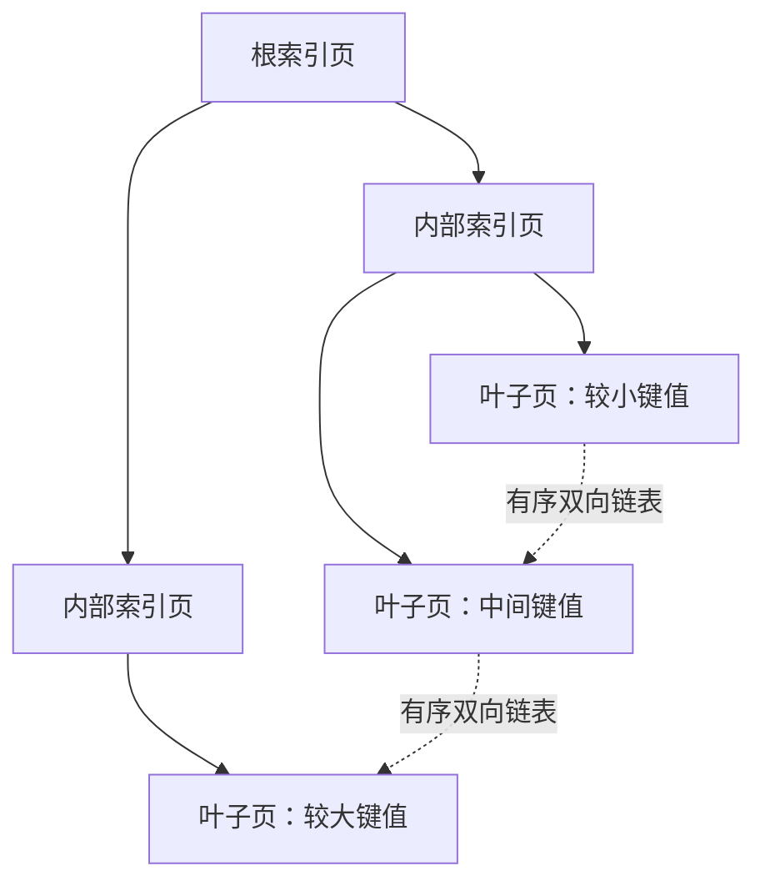
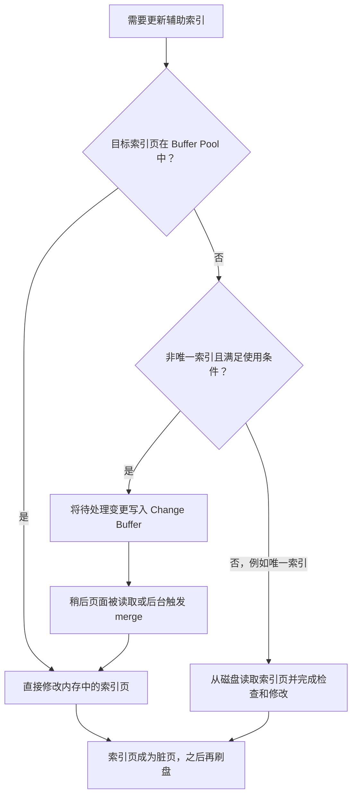
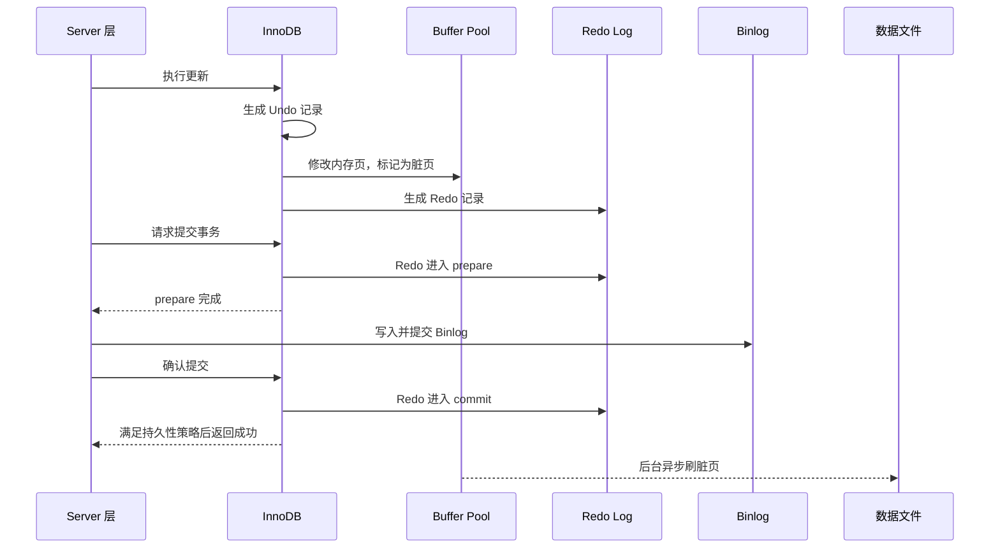

# MySQL 与数据库基础学习笔记

> 本文以 InnoDB 为主。除非特别说明，“数据页”“索引”“事务日志”等均指 InnoDB 中的实现。

## 目录

1. [先建立整体认识](#1-先建立整体认识)
2. [MySQL、InnoDB 与 MyISAM](#2-mysqlinnodb-与-myisam)
3. [数据页、索引页与 B+ 树](#3-数据页索引页与-b-树)
4. [Buffer Pool、Direct I/O 与相关优化](#4-buffer-pooldirect-io-与相关优化)
5. [Undo Log、Redo Log 与 Binlog](#5-undo-logredo-log-与-binlog)
6. [MySQL 的 SQL 处理组件](#6-mysql-的-sql-处理组件)
7. [数据库查询流程](#7-数据库查询流程)
8. [数据库更新流程](#8-数据库更新流程)
9. [把核心机制串起来](#9-把核心机制串起来)
10. [数据库范式与函数依赖](#10-数据库范式与函数依赖)
11. [常见误区速查](#11-常见误区速查)
12. [推荐学习顺序](#12-推荐学习顺序)

## 1. 先建立整体认识

MySQL 是一个关系型数据库管理系统（RDBMS）。它负责接收 SQL、管理连接、选择执行方案、读写数据、处理事务，并在宕机后恢复数据。

MySQL 可以粗略分成两层：



纯文本结构如下，便于在不支持 Mermaid 的阅读器中查看：

```text
客户端
  │ SQL
  ▼
MySQL Server 层
  ├─ 连接器：认证、权限、连接管理
  ├─ 分析器：词法/语法分析，理解 SQL
  ├─ 优化器：选择索引、连接顺序和执行方式
  ├─ 执行器：按执行计划调用存储引擎接口
  └─ binlog：记录逻辑变更，用于复制和数据恢复
  │
  ▼
存储引擎层（通常是 InnoDB）
  ├─ B+ 树索引与数据页
  ├─ Buffer Pool
  ├─ Undo Log / Redo Log
  ├─ Change Buffer
  ├─ 自适应哈希索引
  └─ 事务、锁与 MVCC
  │
  ▼
磁盘上的表空间、日志文件等
```

一句话理解：**Server 层负责“怎样执行 SQL”，存储引擎负责“怎样存取数据”。**

## 2. MySQL、InnoDB 与 MyISAM

### 2.1 MySQL Server 是什么

MySQL Server 是数据库服务进程及其通用功能层。它处理连接、权限、SQL 解析、优化、执行，以及 binlog 等与具体存储引擎相对独立的能力。

### 2.2 InnoDB 是什么

InnoDB 是 MySQL 默认的存储引擎。Server 层的执行器通过存储引擎 API，让 InnoDB 完成查找、插入、更新、删除等操作。它的主要能力包括：

- 支持事务和 ACID；
- 支持行级锁与 MVCC；
- 支持外键；
- 使用 B+ 树组织索引；
- 使用 Buffer Pool 缓存页；
- 使用 Undo Log 和 Redo Log 支持回滚与崩溃恢复。

“SQL 最终都会转换成 InnoDB 接口调用”只在表使用 InnoDB 引擎时成立；如果表使用其他引擎，执行器调用的是相应引擎的接口。

### 2.3 MyISAM 是什么

MyISAM 是 MySQL 较早期常用的存储引擎。它不支持事务、MVCC 和崩溃安全恢复，写入通常使用表级锁。现代业务系统通常优先使用 InnoDB。

| 对比项 | InnoDB | MyISAM |
|---|---|---|
| 事务 | 支持 | 不支持 |
| 锁粒度 | 以行锁为主，也存在其他锁 | 以表锁为主 |
| 崩溃恢复 | 支持 | 能力较弱 |
| 外键 | 支持 | 不支持 |
| 常见用途 | 绝大多数在线业务 | 少量历史或特殊场景 |

## 3. 数据页、索引页与 B+ 树

### 3.1 数据页是什么

磁盘适合成块读写。InnoDB 不会每次只从磁盘读取一行，而是把数据按“页”组织和读写。**页是 InnoDB 管理磁盘数据和 Buffer Pool 缓存数据的基本单位。**

InnoDB 的默认页大小是 16 KiB，可以在初始化实例时通过 `innodb_page_size` 配置为其他受支持的大小，但实例创建后不能随意更改。

为什么默认是 16 KiB：

- 页太小：一次 I/O 读到的相邻数据少，B+ 树层级和管理开销可能增加；
- 页太大：随机查询会读入更多无关数据，也更占内存；
- 16 KiB 是局部性、I/O 成本和管理开销之间的工程折中，并不是所有数据库都固定使用这个大小。

一个数据页中除多条行记录外，还包含页头、页目录、空闲空间等管理信息。

### 3.2 B+ 树是什么

B+ 树是一种多路平衡搜索树。InnoDB 主要使用它组织索引。

- 非叶子节点存放索引键和指向下一层页的指针；
- 叶子节点存放实际索引记录；
- 叶子节点按键值有序，并通过链表相连；
- 树始终保持平衡，从根到各叶子的路径长度相近。

一个索引页可以保存许多键和指针，因此 B+ 树的分支很多、层级通常很少。查找一行往往只需访问少量页，范围查询还可以沿叶子页顺序扫描。

更准确的表述不是“B+ 树是加速查找数据页的树”，而是：**B+ 树用索引键组织页面和记录，使数据库能用较少的页面访问定位记录，并高效完成范围扫描。**



单点查询从根页逐层定位到叶子页；范围查询找到起点后，可以沿叶子页链表继续扫描。

### 3.3 数据页和索引页有什么区别

“数据页”和“索引页”有时是概念上的称呼。在 InnoDB 中，表数据本身也组织在聚簇索引这棵 B+ 树里：

- 聚簇索引的非叶子页：保存主键和子页指针，可称为索引页；
- 聚簇索引的叶子页：保存完整行记录，通常称为数据页；
- 二级索引的叶子页：保存二级索引键和对应主键值，本质上仍是索引页。

### 3.4 聚簇索引与辅助索引

#### 聚簇索引

InnoDB 的表数据按聚簇索引组织，叶子节点保存完整行数据。通常聚簇索引就是主键索引。

- 有主键：使用主键作为聚簇索引；
- 没有主键但有合适的唯一非空索引：可能选择它；
- 两者都没有：InnoDB 生成隐藏的行 ID 来组织聚簇索引。

#### 辅助索引（二级索引）

除聚簇索引以外的索引都是辅助索引。它的叶子节点通常保存：

```text
辅助索引键 + 主键值
```

通过普通二级索引查询完整行时，一般先找到主键，再到聚簇索引查完整记录，这一步叫“回表”。如果查询需要的列都已包含在二级索引中，就可能使用覆盖索引，无需回表。

## 4. Buffer Pool、Direct I/O 与相关优化

### 4.1 Buffer Pool 是什么

Buffer Pool 是 InnoDB 自己管理的一大片内存，主要缓存：

- 数据页和索引页；
- Undo 页；
- Change Buffer 中的部分内容；
- 自适应哈希索引等内部结构。

读取时，InnoDB 先查 Buffer Pool。命中就直接在内存中处理；未命中才从磁盘读取整个页放入 Buffer Pool。

更新时，InnoDB 通常先修改 Buffer Pool 中的页。被修改但尚未写回数据文件的页叫**脏页**。后台线程会在合适时机把脏页刷盘，不要求事务提交时立即把所有数据页写入磁盘。

Buffer Pool 还包含页淘汰、预读、刷脏等机制。它不是简单的键值缓存，而是 InnoDB 存储体系的核心组成部分。

### 4.2 Direct I/O 是什么

操作系统通常也会用 Page Cache 缓存文件。如果 InnoDB 已经用 Buffer Pool 缓存数据，再被 Page Cache 缓存一份，可能造成重复占用内存。

在受支持的平台和相应 `innodb_flush_method` 配置下，InnoDB 可以使用类似 `O_DIRECT` 的方式减少或绕过操作系统文件缓存。是否对读、写都使用 Direct I/O，以及具体行为，取决于操作系统、MySQL 版本和配置。因此不要把“Buffer Pool 必然通过 Direct I/O 读写”当成固定结论。

### 4.3 自适应哈希索引是什么

自适应哈希索引（Adaptive Hash Index，AHI）是 InnoDB 根据访问模式，自动在热点 B+ 树索引页之上建立的内存哈希结构。

- 优点：对符合条件的高频等值查询，可能减少 B+ 树逐层查找；
- 限制：不适合范围查询；建立和维护也有开销，高并发下还可能出现竞争；
- 特点：由 InnoDB 自动管理，用户不能像普通索引一样指定某列建立 AHI，但可以通过配置启停。

它加速的是部分热点索引访问，不是把整个数据页“加入一个普通哈希表”。

### 4.4 Change Buffer 是什么

Change Buffer 是 InnoDB 对**不在 Buffer Pool 中的辅助索引页变更**进行暂存的数据结构。它过去也叫 Insert Buffer，但后来支持插入、删除标记、清理等多类索引变更，因此改名为 Change Buffer。

假设插入一行时需要修改某个二级索引页，而该页当前不在内存中：

```text
没有 Change Buffer：立即随机读取索引页 → 修改页
使用 Change Buffer：先记录待合并的变更 → 以后再批量合并到索引页
```

当目标索引页后来被读入 Buffer Pool、后台线程执行合并，或数据库恢复时，InnoDB 会把暂存变更合并到真实索引页，这个过程叫 change buffer merge。

它的价值在于把多次分散的随机 I/O 推迟并合并，尤其适合写多读少的二级索引。需要注意：

- 主要适用于非唯一辅助索引；
- 唯一索引通常必须先读取目标页检查唯一性，难以获得这一优化；
- 聚簇索引记录本身不通过 Change Buffer 延迟更新；
- 它减少写入当下的随机读，但会增加后续读取或合并的工作；
- Change Buffer 不只是易失内存，它的变更也会持久化并受 Redo Log 保护。

一句话理解：**Change Buffer 不是收集所有写操作的地方，而是专门延迟合并部分辅助索引页修改的机制。**



## 5. Undo Log、Redo Log 与 Binlog

### 5.1 Undo Log 是什么

Undo Log 保存数据修改前所需的信息，主要有两个用途：

1. **事务回滚**：事务失败或主动执行 `ROLLBACK` 时，根据 Undo 恢复到修改前的状态；
2. **MVCC 一致性读**：其他事务可以沿 Undo 版本链读取符合其 Read View 的历史版本。

Undo 不是简单地为每次更新复制一整行，也不能简单理解为一个独立的追加日志文件。它以 Undo 记录的形式存放在 Undo 页中，Undo 页位于 Undo 表空间等持久化区域，也会经过 Buffer Pool；对 Undo 页的修改本身同样会产生 Redo，从而能在崩溃恢复中保持一致。

事务提交后，Undo 也不一定立即删除。只要仍有一致性读需要旧版本，就要保留；之后由 purge 线程清理不再需要的版本。

### 5.2 Redo Log 是什么

Redo Log 是 InnoDB 的重做日志，记录“怎样重放页面变更”所需的信息。更新页之前，相关 Redo 先写入 Redo Log Buffer，再按策略写入磁盘中的 Redo Log 文件。

核心思想是 WAL（Write-Ahead Logging，预写日志）：**数据页落盘前，能恢复该修改的 Redo 必须先持久化。**

这样，事务提交时通常不必立刻随机写回所有脏页，只需优先顺序写入体积较小的 Redo。数据库崩溃重启后，InnoDB 用 Redo 重放尚未写入数据文件的修改。

Redo Log 文件是循环使用的有限空间，不是永久保留全部历史。顺序写通常比大量离散随机写高效，但“快几十倍”不是固定规律，具体差异取决于磁盘、队列、文件系统和工作负载。

事务提交时 Redo 是否每次都真正同步到持久介质，受 `innodb_flush_log_at_trx_commit` 等配置影响。常见的最强持久性配置是每次提交都写并刷 Redo。

### 5.3 Binlog 是什么

Binlog（二进制日志）由 MySQL Server 层维护，记录会造成数据变化的逻辑事件。常见格式有：

- `ROW`：记录行发生了什么变化；
- `STATEMENT`：记录执行过的 SQL；
- `MIXED`：按场景混合选择。

Binlog 的主要用途：

- 主从复制；
- 结合全量备份进行时间点恢复（PITR）；
- 数据订阅、审计或下游同步。

Binlog 是否保留“历史上的所有变更”取决于是否开启、保留期限、磁盘空间和归档策略，不能默认它永久保存。

### 5.4 Redo Log 与 Binlog 的区别

| 对比项 | Redo Log | Binlog |
|---|---|---|
| 所属层 | InnoDB 存储引擎层 | MySQL Server 层 |
| 主要目的 | 崩溃恢复、保证已提交数据的持久性 | 复制、时间点恢复、数据订阅 |
| 内容 | 偏物理的页变更重做信息 | 逻辑变更事件 |
| 适用范围 | InnoDB | Server 层，覆盖支持 binlog 的引擎变更 |
| 写入方式 | 有限空间循环写 | 文件持续追加并轮换 |
| 历史保留 | 被覆盖，不用于长期归档 | 可按策略保留和归档 |

### 5.5 有 Redo Log 为什么还需要 Binlog

二者解决的问题不同：

- Redo 让本机 InnoDB 在宕机后恢复到一致状态；
- Binlog 能把逻辑变更复制到其他实例，并配合备份恢复到指定时间点；
- Redo 是 InnoDB 内部格式且会循环覆盖，不适合作为长期业务变更历史；
- Binlog 属于 Server 层，不只服务于 InnoDB 的内部恢复。

为避免出现“Redo 已提交但 Binlog 没写”或相反的情况，MySQL 对 InnoDB 事务使用内部两阶段提交，大致过程是：

```text
Redo 进入 prepare 状态
        ↓
写入并提交 Binlog
        ↓
Redo 进入 commit 状态
```

崩溃恢复时会结合两份日志的状态判断事务应提交还是回滚，使存储数据和 Binlog 尽量保持一致。

### 5.6 三种日志与 ACID 的关系

- 原子性（Atomicity）：主要依靠 Undo、事务状态和提交协议实现“全部成功或全部失败”；
- 一致性（Consistency）：由数据库约束、事务机制以及业务正确性共同保证；
- 隔离性（Isolation）：主要依靠锁和 MVCC；
- 持久性（Durability）：主要依靠 Redo、刷盘策略和存储系统。

所以，“Redo 保证多行变更要么都成功、要么都失败”并不准确。Redo 更直接地负责持久性与崩溃重做，原子性还依赖 Undo 和事务提交机制。

## 6. MySQL 的 SQL 处理组件

### 6.1 连接器

连接器负责建立和维护客户端连接，包括身份认证、权限检查、连接状态和会话管理。连接成功后，一个会话还会包含当前数据库、事务状态、会话变量等信息。

### 6.2 分析器

分析器对 SQL 进行词法和语法分析，把字符串识别为结构化语法树。例如识别关键字、表名、列名以及表达式关系。之后还会进行表和列解析、权限等相关检查。

### 6.3 优化器

同一条 SQL 往往有多种执行方法。优化器根据统计信息和成本模型选择它认为代价较低的方案，例如：

- 使用哪个索引，或是否全表扫描；
- 多表连接的顺序和算法；
- 条件下推、排序、聚合等操作如何执行。

优化器选择的是估算成本较低的计划，不保证在所有实际数据分布下都是绝对最优。

### 6.4 执行器

执行器按照执行计划运行各个操作，并通过存储引擎接口读取或修改记录，再完成过滤、连接、聚合、排序等处理，最后把结果返回客户端。

### 6.5 执行计划

执行计划是优化器为 SQL 选择的执行路径。可以使用 `EXPLAIN` 查看，例如：

```sql
EXPLAIN SELECT * FROM orders WHERE user_id = 1001;
```

分析时常关注：访问类型、候选索引、实际选择的索引、估算扫描行数、连接顺序，以及是否出现临时表或额外排序。MySQL 8.0 还可使用 `EXPLAIN ANALYZE` 执行 SQL 并展示实际耗时和行数，但对修改语句使用前要注意其确实会执行。

## 7. 数据库查询流程

以一条 `SELECT` 为例：

1. **建立连接**：客户端与连接器建立会话，完成认证和权限处理；
2. **解析 SQL**：分析器识别 SQL 结构，检查基本语法与对象引用；
3. **生成执行计划**：优化器基于索引和统计信息选择访问路径；
4. **执行计划**：执行器调用 InnoDB 接口取数；
5. **定位记录**：InnoDB 根据执行计划遍历聚簇索引或辅助索引的 B+ 树；
6. **读取页面**：目标页在 Buffer Pool 中则直接使用，否则从磁盘读入；
7. **完成可见性判断**：一致性读根据 Read View 和 Undo 版本链判断记录是否可见；
8. **返回结果**：执行器完成剩余过滤、连接、聚合或排序并返回客户端。

如果访问模式符合条件，InnoDB 可能通过自适应哈希索引加速热点等值查询，但这不是每次查询都会发生。MySQL 8.0 已移除旧式 Server 查询缓存，不要把它与 Buffer Pool 混淆。

## 8. 数据库更新流程

以 InnoDB 表的一次更新事务为例，简化流程如下：

1. Server 层完成连接、解析和优化，执行器调用 InnoDB；
2. InnoDB 开启或加入当前事务，定位记录并按需加锁；
3. 生成 Undo 记录，用于回滚和 MVCC；
4. 生成 Redo 记录并先写入 Redo Log Buffer；
5. 在 Buffer Pool 中修改数据页，使其成为脏页；
6. Server 层为事务变更生成 Binlog 事件，先放入事务自己的 Binlog Cache；
7. 提交时通过 Redo prepare、Binlog 提交、Redo commit 协调两份日志；
8. 满足刷盘策略后向客户端返回提交成功；
9. 后台线程之后再把脏页写回数据文件。

步骤 3～5 在内部会相互配合，不能理解为所有场景都严格按一条简单时间线执行。关键约束是数据页落盘前，对应 Redo 必须先持久化。

对于辅助索引页的更新，如果目标页不在 Buffer Pool、索引符合条件且无需立刻读取页面验证，InnoDB 可以先写入 Change Buffer，之后再合并。它只是更新流程中的一个条件分支，并非所有写操作都经过 Change Buffer。

还要注意：普通写操作并不是简单地“所有 Redo 周期性刷盘”。事务提交时是否写入并同步 Redo、Binlog，由持久性配置决定；后台周期性刷盘只是其中一部分。

下面的时序图展示了主干流程，省略了锁、组提交和不同刷盘参数造成的细节差异：



## 9. 把核心机制串起来

```text
查询：
SQL → 优化器选索引 → B+ 树定位页 → Buffer Pool 命中或磁盘读页 → 返回记录

更新：
旧版本信息 → Undo
页面变更   → Buffer Pool 中的脏页 → 稍后随机写回数据文件
重做信息   → Redo Log Buffer → 提交时优先顺序写 Redo
逻辑变更   → Binlog Cache → 提交时写 Binlog
部分二级索引页不在内存 → Change Buffer → 以后合并
```

这套设计的核心目的，是把事务提交与大量随机数据页写入解耦：先用日志以较低成本保证可恢复性，再异步、批量地把脏页落盘。

## 10. 数据库范式与函数依赖

范式用于减少数据冗余和插入、更新、删除异常。实际设计还需要在一致性、查询性能和维护成本之间权衡，有时会有意识地做反范式设计。

### 10.1 函数依赖

如果属性组 X 的值一旦确定，属性组 Y 的值也能唯一确定，就称 **Y 函数依赖于 X**，写作：

```text
X → Y
```

例如：

```text
学生编号 → 学生姓名
订单编号 → 下单时间
```

#### 完全函数依赖

Y 依赖于整个复合属性组 X，去掉 X 中任何一个属性后都不能确定 Y。

例如订单明细表的候选键为 `(订单编号, 商品编号)`：

```text
(订单编号, 商品编号) → 购买数量
```

只知道订单编号或只知道商品编号，都不能确定购买数量，因此是完全函数依赖。

#### 部分函数依赖

Y 看似依赖复合键 X，但仅靠 X 的一部分就能确定 Y。

```text
(订单编号, 商品编号) → 商品名称
商品编号 → 商品名称
```

商品名称只依赖商品编号，因此它对复合键是部分函数依赖。

#### 传递函数依赖

如果 `X → Y`、`Y → Z`，且 Y 不是候选键，Z 便可能通过 Y 传递依赖于 X。

```text
订单编号 → 客户编号
客户编号 → 客户名称
因此：订单编号 → 客户名称（传递依赖）
```

### 10.2 第一范式（1NF）

第一范式要求每个字段保存当前数据模型下不可再拆分的单一值，不在一个单元格里存放多个同类值。

不推荐：

| 用户 ID | 电话号码 |
|---|---|
| 1 | `138...、139...` |

可拆为用户表和用户电话表，每个电话占一行。

“原子”与业务语义有关。例如完整地址是否拆成省、市、区，取决于系统是否需要分别查询和约束这些部分。

### 10.3 第二范式（2NF）

在满足 1NF 的基础上，所有非主属性都必须**完全依赖于每一个候选键**，不能只依赖复合候选键的一部分。

原表：

```text
订单明细(
  订单编号,
  商品编号,
  下单时间,
  商品名称,
  购买数量,
  PRIMARY KEY (订单编号, 商品编号)
)
```

依赖关系：

```text
订单编号 → 下单时间
商品编号 → 商品名称
(订单编号, 商品编号) → 购买数量
```

`下单时间` 和 `商品名称` 都只依赖复合主键的一部分，违反 2NF。可拆为：

```text
订单(订单编号, 下单时间, ...)
商品(商品编号, 商品名称, ...)
订单明细(订单编号, 商品编号, 购买数量)
```

若候选键都是单列，通常不会出现针对该候选键的部分依赖问题。

### 10.4 第三范式（3NF）

在满足 2NF 的基础上，非主属性不能传递依赖于候选键。通俗地说，非键字段应直接描述“这张表的键”，而不应依赖另一个非键字段。

原表：

```text
订单(订单编号, 客户编号, 客户名称)
```

依赖关系：

```text
订单编号 → 客户编号
客户编号 → 客户名称
```

`客户名称` 通过 `客户编号` 传递依赖于 `订单编号`，会造成客户改名时多行订单都要更新。可拆为：

```text
订单(订单编号, 客户编号)
客户(客户编号, 客户名称)
```

### 10.5 一句话记忆

- 1NF：一格一值，字段具有原子性；
- 2NF：非键字段依赖整个候选键，而不是复合键的一部分；
- 3NF：非键字段直接依赖候选键，而不是依赖另一个非键字段。

常见口诀“属性依赖于键、整个键，并且只依赖于键”，分别对应 1NF 之后对 2NF 和 3NF 的核心要求。不过正式判断时应以候选键和函数依赖为准，而不只看声明的主键。

## 11. 常见误区速查

1. **Buffer Pool 不等于操作系统 Page Cache**：前者由 InnoDB 管理，后者由操作系统管理。
2. **Direct I/O 不是 Buffer Pool 的定义**：是否使用取决于平台和配置。
3. **Change Buffer 不缓存所有写操作**：它只优化符合条件的辅助索引页变更。
4. **辅助索引叶子通常存主键，不直接存“数据页地址”**：因此查询完整行常需要回表。
5. **Undo 不只用于回滚**：它还为 MVCC 提供历史版本。
6. **Redo 不等于完整事务历史**：它循环使用，主要服务于 InnoDB 崩溃恢复。
7. **Binlog 不等于必然永久保存**：能恢复多远取决于备份、保留和归档策略。
8. **事务原子性不由 Redo 单独保证**：Undo、Redo 和提交协议各自承担不同职责。
9. **提交事务不等于立刻刷完数据页**：通常先确保日志满足持久性条件，脏页之后再刷。
10. **HDFS 与这套 MySQL 内部机制不是同一概念**：HDFS 是面向分布式大文件存储的文件系统，可另开一个主题学习。

## 12. 推荐学习顺序

```text
MySQL 两层架构
  → 页与 B+ 树
  → 聚簇索引和辅助索引
  → Buffer Pool 与脏页
  → Undo / Redo / Binlog
  → 一条查询和一条更新的完整流程
  → 锁、MVCC 与隔离级别
  → 执行计划与 SQL 优化
```

掌握这条主线后，再深入页分裂、回表、覆盖索引、WAL、Checkpoint、两阶段提交、Read View 等细节，会更容易形成整体框架。
