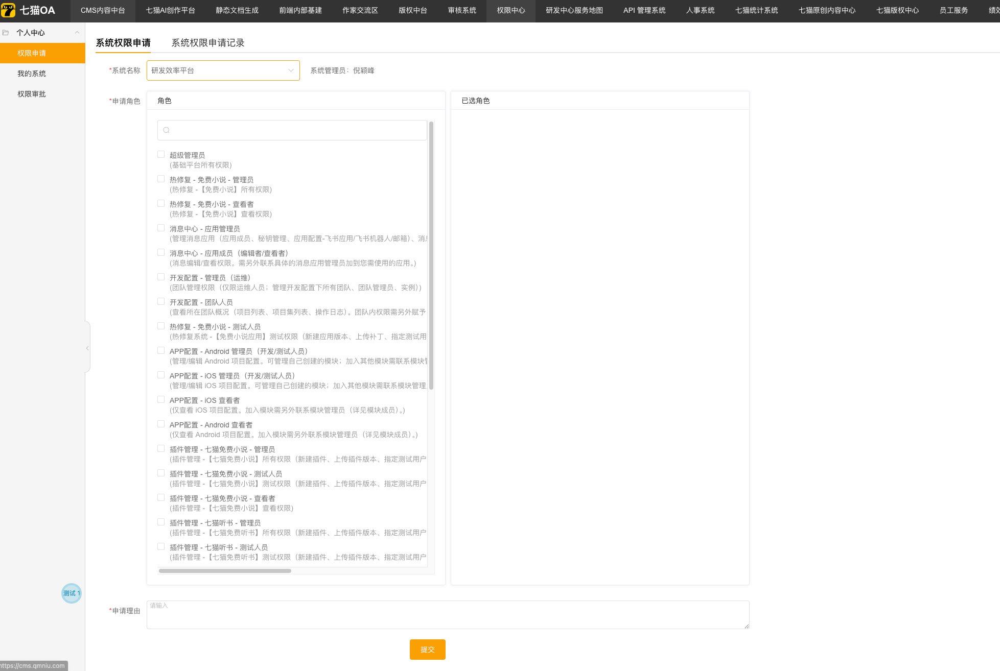
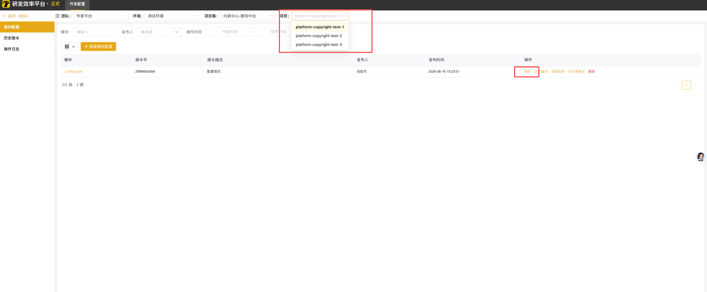
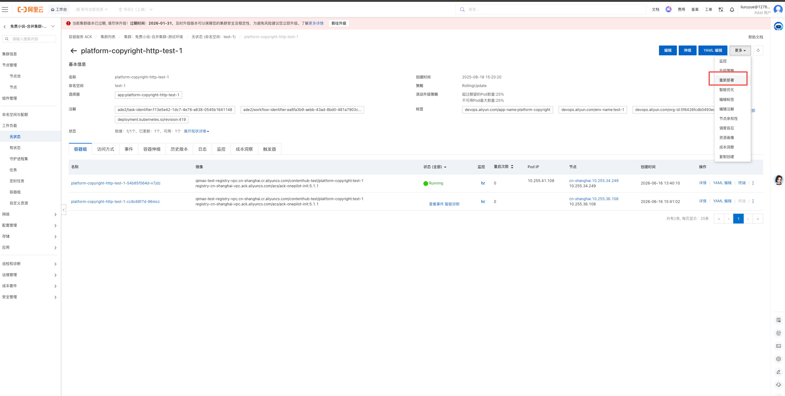
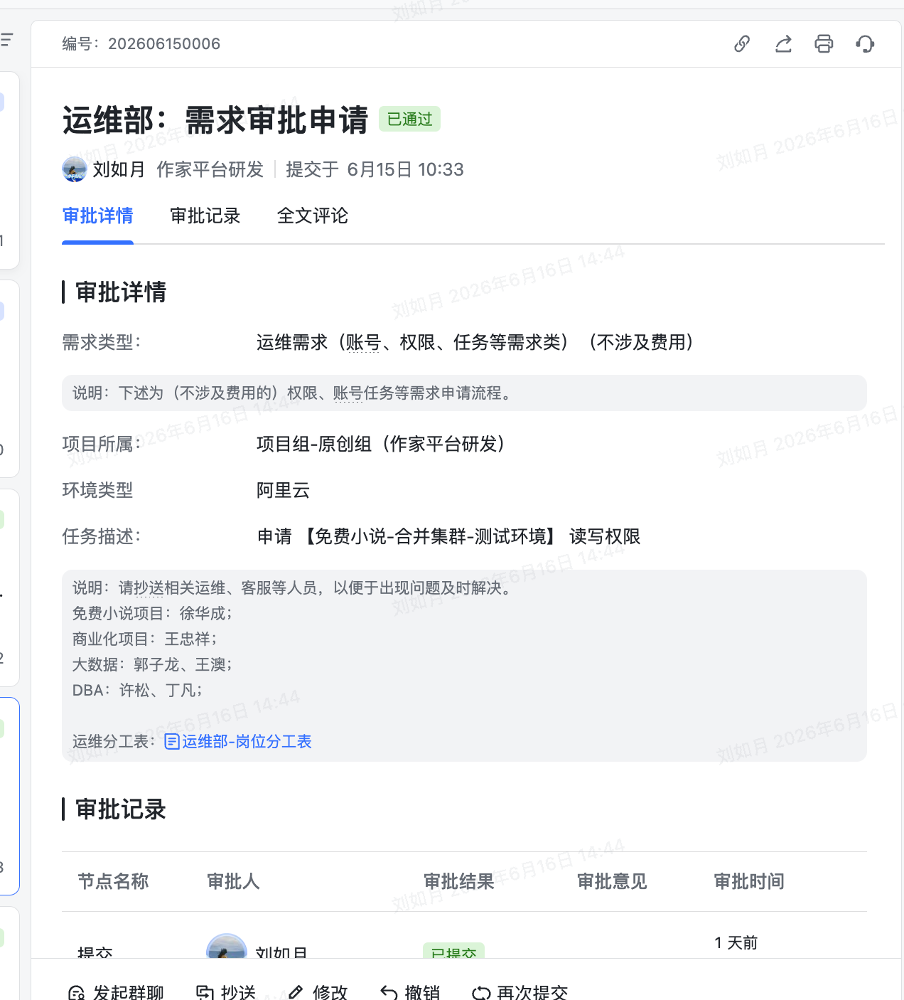
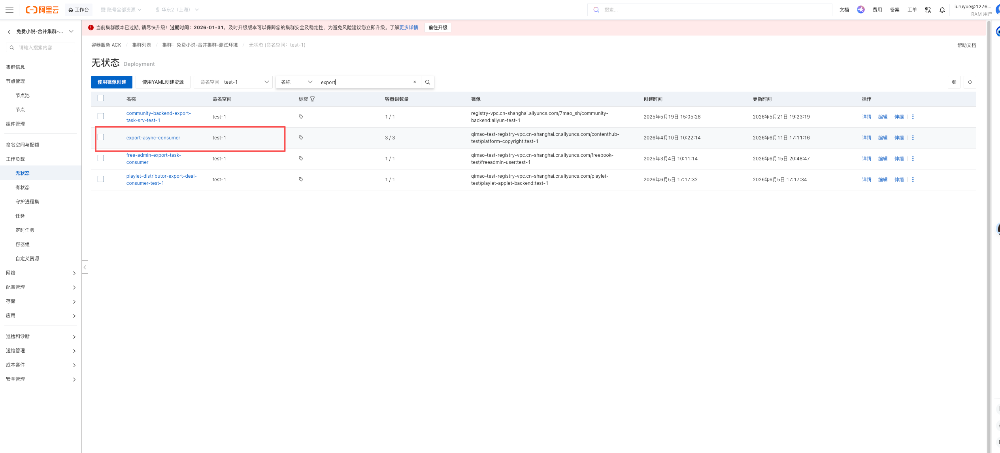
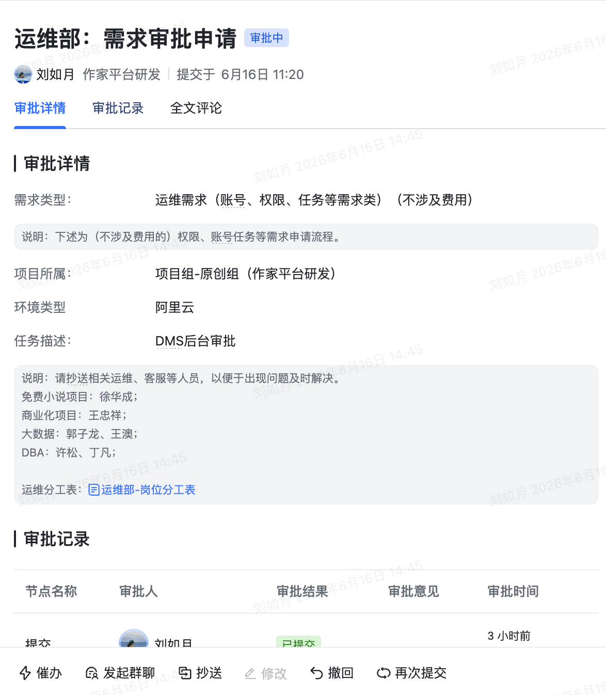

## 全栈开发怎么开始
1. worktree
2. 
## 服务端开发完怎么自测
1. test/test-1，合并代码后会自动触发proto包的更新
2. 让服务端代码cr
	1. 服务端改个枚举的文案可能要改字段命名
	2. 不需要的代码直接删除，如果不删除要加注释的备注
3. 新增header字段需要生成配置`go run main.go consumer export-init`,执行完后 会在数据库生成数据，这时候后台会看到导出的字段，要在页面上生效还要自己在后台配置字段。导出消费要重启。
4. 
## 服务端怎么上线
### 申请权限
> 如果你要是改到了`configs/debug/config.yaml`这个文件，就要在这里同步改下

https://infrastructure.qmniu.com/ 
修改测试环境配置：

重新部署platform-copyright-http-test-1

### 申请集群
> 如果你要执行脚本，例如导出、权限配置等，就要在这里执行。申请信息可以填“免费小说-合并集群-测试环境 读写权限”

https://csnew.console.aliyun.com/
这里是导出

### 申请dms
> 如果你修改了数据库相关的，就要在这里提交工单
   
https://dms.aliyun.com/
执行sql

申请数据变更

上线文档怎么写
- DML语句 ，需要补一条插入的sql
    sql需要自己先验证
- 发布源站部分，需要补对应的启动脚本（
    

- 导出配置初始化
    
- 导出服务重启
    

- 发布外网，权限配置
    

- 新增的字段要给角色授权